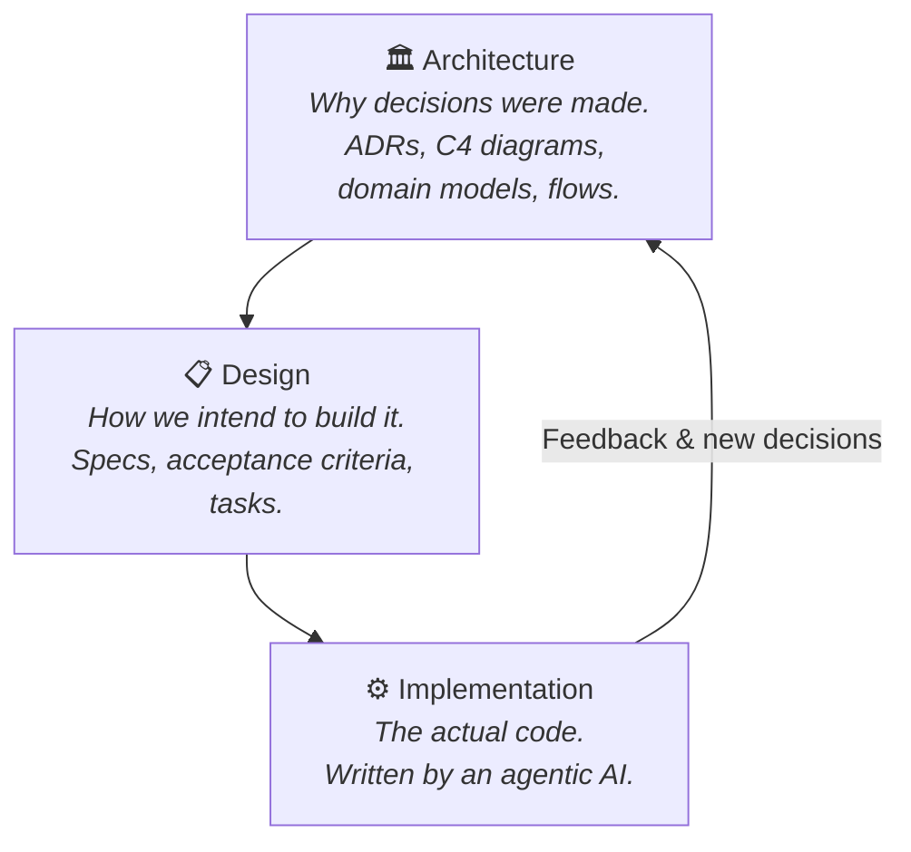
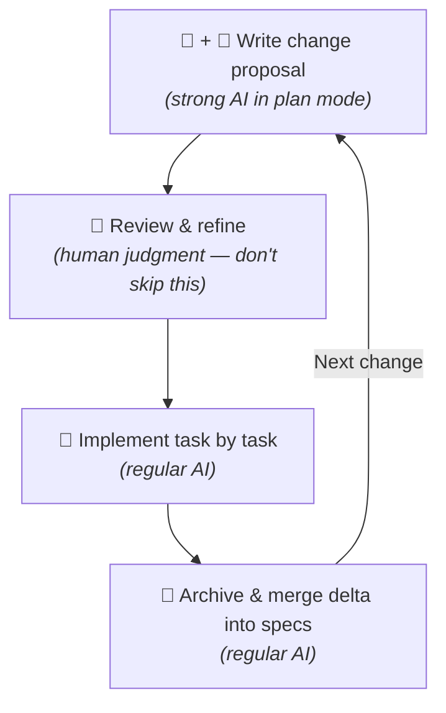
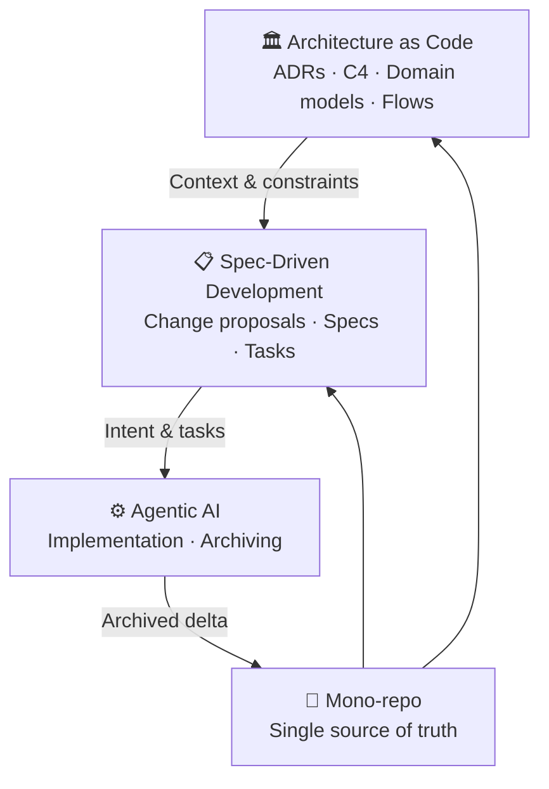

# 📋 Think in Specs — The Modern Developer's Mindset

**Developing Software in the Agentic AI Age**

---

👉 [Read on Hashnode](#) *(coming soon)*

---

This article builds on the foundation from the previous 'Architecture as Code' articles:

- [Keep Your Architecture Diagrams in Code, Not in Tools](../1.%20Keep%20Your%20Architecture%20Diagrams%20in%20Code,%20Not%20in%20Tools/README.md) ([Hashnode](https://architecture-as-code.hashnode.dev/keep-your-architecture-diagrams-in-code-not-in-tools))
- [Keep Your AI and Architecture-Design in Sync](../2.%20Keep%20Your%20AI%20and%20Architecture-Design%20in%20Sync/README.md) ([Hashnode](https://architecture-as-code.hashnode.dev/keep-your-ai-and-architecturedesign-in-sync))
- [Architecture as Code in Practice](../3.%20Architecture%20as%20Code%20in%20Practice/README.md) ([Hashnode](https://architecture-as-code.hashnode.dev/architecture-as-code-in-practice))

---

## 🎯 TL;DR

Your job is still software development — **just without the coding.**

The previous articles showed *how* to store architecture as code (AoC), *how* to design features before writing code ([SDD](https://en.wikipedia.org/wiki/Spec-driven_development)), and *how* to use agentic AI to do the implementation. This article is about the mindset that ties it all together: **nothing has fundamentally changed about how we develop software — we still work across architecture, design, and implementation.** We have simply stopped being required to write the production code ourselves.

---

## 🧭 The Three Layers (Still the Same as Always)

Software development has always moved through three layers:

In the agentic AI age, these map directly to:

| Layer              | Practice                      | Tooling                                             |
|--------------------|-------------------------------|-----------------------------------------------------|
| **Architecture**   | Architecture as Code (AoC)    | Markdown, Mermaid, [ADRs](https://adr.github.io/madr/), [C4 Views](https://c4model.com/) |
| **Design**         | [Spec-Driven Development (SDD)](https://en.wikipedia.org/wiki/Spec-driven_development) | [OpenSpec](https://openspec.dev/), proposal.md, design.md, tasks.md, spec.md |
| **Implementation** | Agentic AI                    | Claude Code, GitHub Copilot, Cursor…                |

The key insight: **AI is excellent at implementation. Humans are still required for architecture and design.** Feed the AI well-structured context, and it will reward you with code that respects your intent.

> ⚠️ **A word of honesty:** LLMs are not truly *intelligent* — they are extraordinarily capable automation engines. They recognize patterns, complete instructions, and generate plausible output at scale. That is exactly why they excel at implementation: code is highly structured and pattern-rich. Architecture and design, by contrast, require *judgment*, *intent*, and *accountability* — things that still require a human in the loop.

---

## 🕰️ The Role Has Always Evolved

This is not the first time the developer's job has changed. It has been changing continuously:

| Era     | Tool / Shift                 | What changed                                    |
|---------|------------------------------|-------------------------------------------------|
| 1940s   | Plugboards & paper tape      | Humans *were* the computers                     |
| 1950s   | Assembly & FORTRAN           | Abstracted away machine code                    |
| 1970s   | Structured languages (C)     | Abstracted away hardware-specific assembly      |
| 1980s   | IDEs & debuggers             | Integrated the edit-compile-debug toolchain     |
| 1990s   | OOP & version control        | Encapsulated complexity; tracked change history |
| 2000s   | Managed runtimes (.NET, JVM) | Abstracted away memory management               |
| 2010s   | Cloud, containers, CI/CD     | Abstracted away infrastructure                  |
| 2020s   | AI code completion (Copilot) | Abstracted away boilerplate                     |
| **Now** | **Agentic AI**               | **Abstracted away the coding**                  |

Each step made developers *more powerful*, not obsolete. Agentic AI is no different — it just raises the bar for what "doing the work" means. The developers who thrive are the ones who double down on architecture and design, because that is what the AI cannot do for you.

As AI automation continues to advance, the AI's share of the implementation work will only grow. But developers will likely remain in the loop — not because the AI can execute, but because **intent, judgment, and accountability** are human responsibilities. An LLM has no stake in the outcome. You do.

---

## 🗂️ ADRs as Machine-Readable Intent

Agentic AI thrives on **context** and **intent** — both of which are usually buried in a developer's head rather than in the source code. [Architectural Decision Records (ADRs)](https://adr.github.io/madr/) turn that tribal knowledge into machine-readable instructions.

Here is why they are a game-changer for autonomous agents:

| Benefit                 | Without ADRs                                | With ADRs                                                |
|-------------------------|---------------------------------------------|----------------------------------------------------------|
| **Guardrails**          | Agent picks any library or pattern it likes | Agent stays within explicitly accepted decisions         |
| **Refactoring safety**  | Agent "fixes" code that was intentional     | Agent understands the *why* and leaves it alone          |
| **Reasoning alignment** | Agent guesses the rationale                 | Agent reads the logical derivation                       |
| **Impact analysis**     | Agent proposes changes blindly              | Agent cross-references its plan against accepted records |
| **ADR generation**      | Written manually, often skipped             | Agent drafts the ADR from the PR diff                    |

> **Bottom line:** ADRs turn "tribal knowledge" into "machine-readable intent."

See [Architecture as Code in Practice](../3.%20Architecture%20as%20Code%20in%20Practice/README.md) for how to structure ADRs alongside C4 diagrams and domain models in your repository.

---

## 📐 Spec-Driven Development (SDD)

[SDD](https://en.wikipedia.org/wiki/Spec-driven_development) means writing a spec that captures design intent *before* any code is written. The agentic AI then uses that spec as its instruction manual.

A change proposal (e.g. using [OpenSpec](https://openspec.dev/)) contains:

- **`proposal.md`** — the what, why, and acceptance criteria
- **`specs/`** — per-feature specifications (referenced, never duplicated from architecture)
- **`tasks.md`** — the ordered list of implementation tasks

The workflow is deliberately front-loaded:

> 💡 **Tip:** Always run spec creation with the AI in **plan mode** — it will ask about anything ambiguous rather than guess. Tell it to keep specs DRY and to-the-point.

> 💡 **Tip:** Specs should *reference* architecture documents (ADRs, domain models), never duplicate them. Architecture changes; references stay valid. Duplication drifts.

### Why the upfront cost is worth it

- **Forces clarity before commitment** — design issues surface when they are inexpensive to fix, not after implementation
- **AI as a nitpicker** — plan-mode AI exposes ambiguity and underspecified edge cases at review, not during testing
- **Documentation by construction** — the spec *is* the design document; it exists before the code does
- **Change proposals replace code reviews** — reviewers verify the proposal is sound and internalize the design; once the spec is approved and the AI has implemented it, a human code review of the generated code adds little additional confidence

> In short: SDD moves the hard thinking — and the human judgment — to the moment when it has the highest leverage.

For the full OpenSpec workflow (steps, prompts, and a worked example), see [Keep Your AI and Architecture-Design in Sync](../2.%20Keep%20Your%20AI%20and%20Architecture-Design%20in%20Sync/README.md).

---

## 🔁 The Complete Workflow

AoC + SDD + Agentic AI form a closed loop:

One true benefit of this approach: **documentation must be written up front.** The AI needs accurate, up-to-date context — the same way a new team member would. Outdated or missing documentation produces poor AI output for the same reason it produces poor human output.

---

## 🔗 References

| Resource                                                                                                                     | Description                                                                                       |
|------------------------------------------------------------------------------------------------------------------------------|---------------------------------------------------------------------------------------------------|
| [OpenSpec](https://openspec.dev/)                                                                                            | The open specification format used for change proposals and spec-driven workflows in this article |
| [Spec-Driven Development — Wikipedia](https://en.wikipedia.org/wiki/Spec-driven_development)                                 | Overview of the SDD methodology                                                                   |
| [MADR — Markdown Architectural Decision Records](https://adr.github.io/madr/)                                                | A lightweight ADR template format designed to be readable by both humans and machines             |
| [C4 Model](https://c4model.com/)                                                                                             | The C4 approach to visualizing software architecture (Context, Containers, Components, Code)      |
| [The C4 Model for Visualizing Software Architecture](https://leanpub.com/the-c4-model-for-visualising-software-architecture) | Simon Brown's book on the C4 model                                                                |
| [Structurizr DSL](https://structurizr.com/dsl)                                                                               | Domain-specific language for defining C4 architecture models as code                              |
| [Architecture Decision Records (ADR GitHub org)](https://adr.github.io/)                                                     | Community resources, tooling, and templates for ADRs                                              |
| [thoughtworks.com — Evolutionary Architecture](https://www.thoughtworks.com/radar/techniques/evolutionary-architecture)      | Background on treating architecture as a living, evolving artifact                                |

---

## 📖 Navigation

← **[Previous: Architecture as Code in Practice](../3.%20Architecture%20as%20Code%20in%20Practice/README.md)**

→ **[Up next: Spec-Driven Test Strategy: Turning Acceptance Criteria into Tests](#)** *(future article)*

---

**Repository:** [architecture-as-code-example](/README.md)

---

#SpecDrivenDevelopment #ArchitectureAsCode #AgenticAI #SoftwareArchitecture #DeveloperMindset #TechWriting #OpenSpec
