# Spec-Driven Development: How We Propose to Work

**Architecture as Code · OpenSpec · Agentic AI**

*Presented by: Flemming N. Larsen*

---

## The Three Layers — Still the Same as Always

Software development has always moved through three layers.  
**Nothing has fundamentally changed — except who writes the code.**

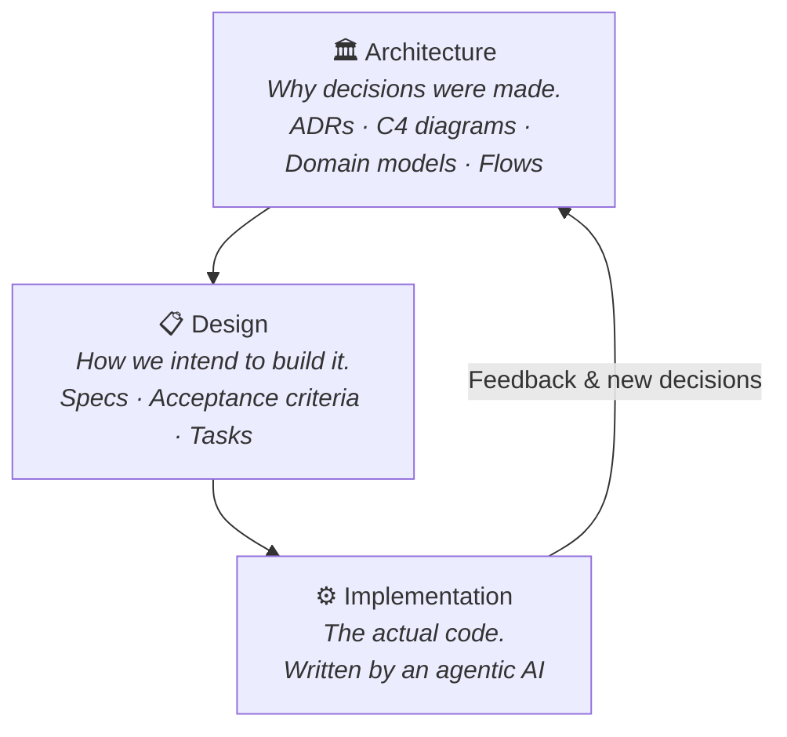

| Layer | Practice | Artefacts |
|---|---|---|
| **Architecture** | Architecture as Code | ADRs · C4 views · Domain models |
| **Design** | Spec-Driven Development | `proposal.md` · `specs/` · `tasks.md` |
| **Implementation** | Agentic AI | Claude · GitHub Copilot · Cursor |

> **AI is excellent at implementation. Humans are still required for architecture and design.**  
> Feed the AI well-structured context — it will reward you with code that respects your intent.

---

## The Central Question: When Do We Create What?

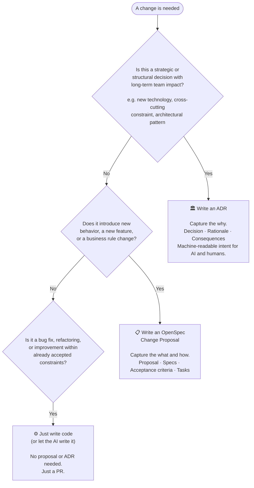

---

## ADR — When and Why

**Create an ADR when a decision...**

- Chooses a technology, library, or framework the whole team must follow
- Establishes an architectural pattern or cross-cutting constraint
- Needs to be understood *months or years from now* by people who weren't there
- Affects how the AI should behave — ADRs are guardrails for autonomous agents

### Real Examples from Our Codebase

| ADR | Decision | Why it matters |
|---|---|---|
| [ADR-0001](../docs/architecture/adr/0001-use-uuid-primary-keys.md) | Use UUIDs for all primary keys | Distributed ID generation, no collisions, safe data migration |
| [ADR-0002](../docs/architecture/adr/0002-microservices-architecture.md) | Microservices architecture | Independent deployability, team autonomy, domain isolation |
| [ADR-0003](../docs/architecture/adr/0003-event-driven-communication.md) | Event-driven communication | Loose coupling, scalability, eventual consistency |

### What ADRs do for AI agents

| Without ADRs | With ADRs |
|---|---|
| Agent picks any library it likes | Agent stays within accepted decisions |
| Agent "fixes" intentional code | Agent understands the *why* and leaves it alone |
| Agent guesses the rationale | Agent reads the logical derivation |
| Agent proposes changes blindly | Agent cross-references against accepted records |

> **ADRs turn tribal knowledge into machine-readable intent.**

---

## OpenSpec Change Proposal — When and Why

**Create a change proposal when you need to...**

- Introduce a new feature with business rules
- Change existing behavior in a meaningful way
- Align the team *before* any code is written
- Give the AI a complete, reviewable instruction manual

### Real Example: Loyalty Points System

> `openspec/changes/loyalty-points/proposal.md`

A change proposal contains:

```
loyalty-points/
  proposal.md   ← What, why, acceptance criteria, business rules
  tasks.md      ← Ordered implementation tasks for the AI
  specs/        ← Spec delta: additions/changes to existing specs
```

**This is a *slice of functionality* — small enough to reason about, complete enough to test.**

The proposal for loyalty points defines:
- Earning rules (1 point per $1, minimum $5 order, max 500 per order)
- Redemption rules (min 100 pts, max 50% of order total)
- Expiration rules (12 months, daily midnight UTC)
- Edge cases (refunds, account merging, negative balances)

> The proposal *is* the design document. It exists before the code does.

---

## What a Change Proposal Actually Is

> **One proposal = one coherent thing.**  
> Not "some improvements." Not "a few fixes."  
> One thing — like *"Create a Minting Registry"* or *"Add Customer Loyalty Points."*

### Created together with the AI — in Plan mode

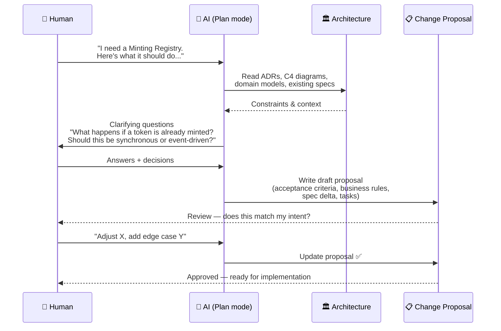

**The AI structures your intent. You verify it is correct.**  
Plan mode means the AI asks rather than assumes — ambiguity is resolved before any code is written.

### Architecture constrains the proposal

The existing architecture is not optional context — it is the **constraint layer**:

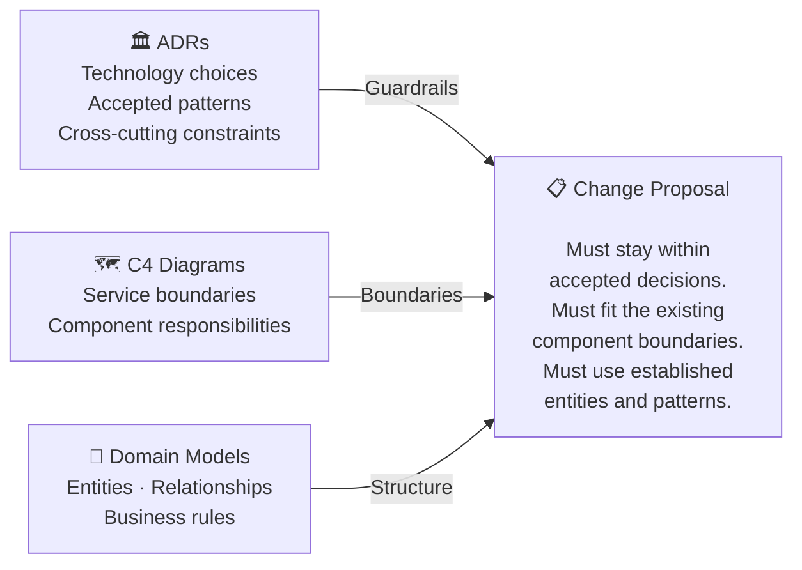

If the proposal *cannot* fit within the existing architecture, that is a signal:  
→ **A new ADR may be needed first.** Design the architecture change, then design the feature.

### The test package = proof of INTENT

The change proposal does not just describe what to build — it comes with a **test package** that proves the implementation fulfills the intent.

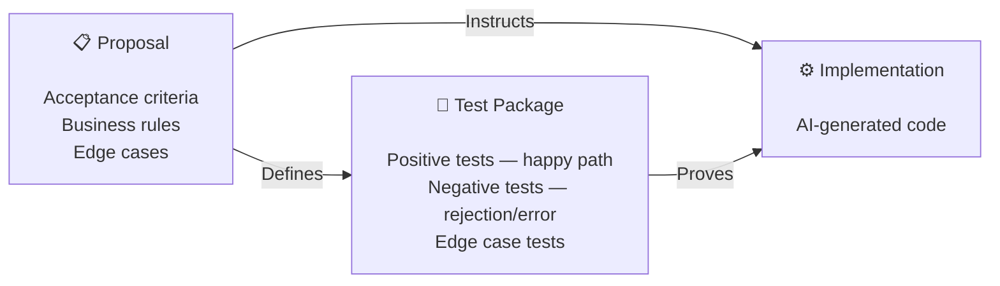

> **If the tests pass, the code fulfills the intent of the proposal.**  
> That is the proof. Not a manual line-by-line review of every file.

---

## Just Code — When No Spec Is Needed

Some changes simply do not warrant a proposal or an ADR:

- **Bug fix** within existing, already-specified behavior
- **Refactoring** — same behavior, cleaner code
- **Performance tweak** within accepted architectural constraints
- **Dependency update** (patch version, no API change)

Just open a PR. The existing specs and ADRs provide all the context the AI needs.

> **When in doubt:** If the change affects *what the system does*, write a proposal.  
> If it only affects *how the system does it*, just write code.

---

## The Full OpenSpec Process

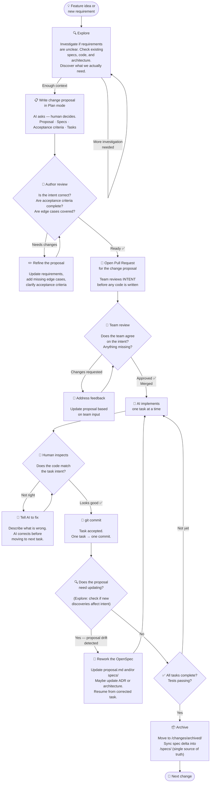

### The key insight: **work is front-loaded by design**

The PR is opened on the **proposal** — not on 100 files of generated code.  
The team reviews INTENT when it is cheapest to change: before implementation begins.

---

## Explore — When Requirements Are Unclear

**Explore before you propose** if you need to discover something first:

- Requirements are vague — what does the codebase actually look like?
- You suspect the change may affect more than expected
- You want to check if an existing spec already covers it

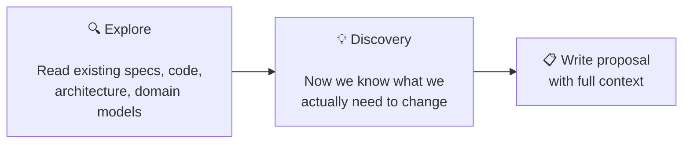

**Explore also mid-implementation** — after each commit, ask:  
*"Has what I discovered changed the intent of the proposal?"*

- **No** → continue to next task
- **Yes** → rework the proposal, then resume

> `/opsx:explore` in OpenSpec is the action for this.  
> Think of it as: *"check my understanding before I continue."*

---

## One Task at a Time · One Commit at a Time

**Recommended implementation rhythm:**

A **task** is a top-level item in `tasks.md` — it may contain several subtasks.  
The AI implements the **whole task** (all its subtasks) in one go. Not subtask by subtask.

```
## 1. Core Infrastructure          ← Task 1 — AI does all of this at once

- [ ] 1.1 Create LoyaltyPoints entity with migrations
- [ ] 1.2 Add loyalty-related fields to Customer entity
- [ ] 1.3 Add loyalty-related fields to Order entity
- [ ] 1.4 Create point calculation service
- [ ] 1.5 Create point expiration background job

## 2. Point Earning                ← Task 2 — next, after Task 1 is committed
```

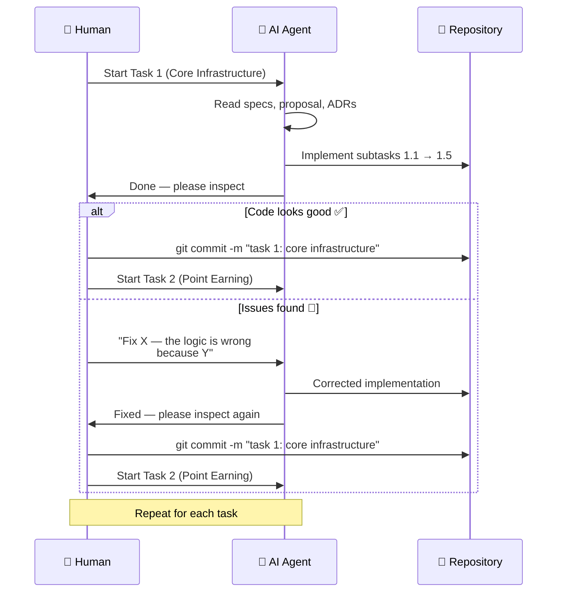

**Why this rhythm matters:**
- Accountability stays with the human — you own every commit
- One task = one coherent concern, easy to reason about as a whole
- Problems are caught before they compound into the next task
- You can course-correct the spec *between* tasks if needed

---

## Archive — Done-Done

**Archive means the change is truly complete.**

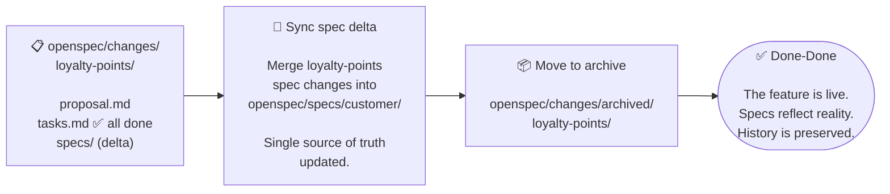

**Done-Done means:**
- All tasks checked off in `tasks.md`
- Tests pass (acceptance criteria covered)
- Spec delta merged into `/openspec/specs/` — the living specification
- Change moved to `/changes/archived/` — history preserved, working directory clean

> `/opsx:archive` in OpenSpec does this in one step.

---

## The Testing Contract

> **Every acceptance criterion must be covered by tests.**

### Minimum coverage per criterion:

| | |
|---|---|
| ✅ **One positive test** | The happy path — criterion is met under normal conditions |
| ❌ **One negative test** | The failure path — system behaves correctly when criterion is violated |
| 🎁 **More is welcome** | Edge cases, boundary values, concurrent scenarios |

### The Change Proposal = a Slice + a Test Package

The proposal's acceptance criteria *are* the test specification.  
Tests prove the implementation fulfills the **intent** of the proposal.

### Example from the Loyalty Points proposal:

| Acceptance Criterion | Positive Test | Negative Test |
|---|---|---|
| Earn 1 pt per $1 on delivered orders | Order $50 → earn 50 pts ✅ | Order pending → no pts awarded ❌ |
| Minimum order $5 to earn points | $5.00 order → pts awarded ✅ | $4.99 order → no pts ❌ |
| Max 500 pts per order | $1000 order → capped at 500 pts ✅ | — |
| Min redemption: 100 pts | 100 pts → $1.00 discount ✅ | 99 pts → redemption rejected ❌ |
| Points expire after 12 months | 12 months + 1 day → expired ✅ | 11 months + 30 days → still valid ❌ |

> **The test package is proof.** If the acceptance criteria are covered and the tests pass,  
> the implementation fulfills its intent — regardless of who or what wrote the code.

---

## INTENT is What We Review

**We do not review 100 file changes. We review the INTENT.**

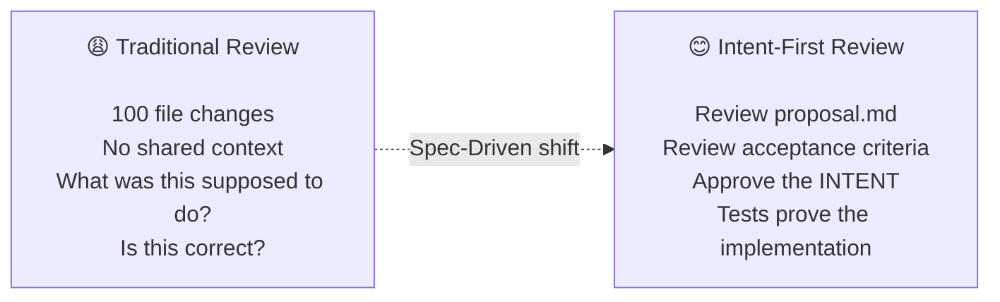

### What we review — and when

| Stage | What is reviewed | Who reviews |
|---|---|---|
| **Proposal review** | Does the intent make sense? Are criteria complete? | 👤 Human (high leverage) |
| **Test review** | Does the test package cover the acceptance criteria? | 👤 Human |
| **Code review** | Does the generated code look right? | 👤 Human (for now) |

### Current state vs. the goal

| Now | Goal |
|---|---|
| We review everything | Proposal review *is* the quality gate |
| Trust is being built | Approved spec + passing tests = confidence |
| Code review catches gaps | Spec review catches gaps — earlier and cheaper |

> **For now: we review everything.**  
> We are building trust in the process — and in ourselves as spec authors.

---

## The Vision

> *"We have this in place — we do not need to review 100 file changes manually anymore."*

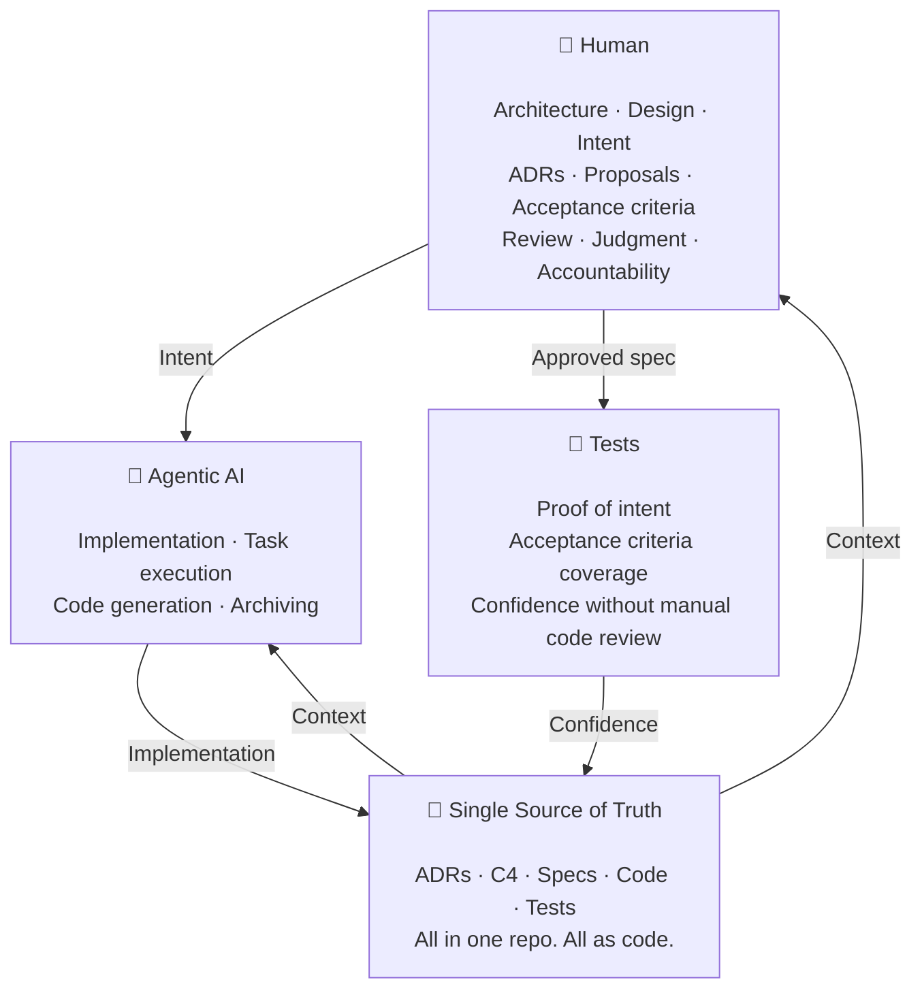

### What this gives us

- 🏛️ **ADRs** preserve decisions — the AI knows the guardrails
- 📋 **Specs** preserve intent — the AI knows what to build
- 🧪 **Tests** prove correctness — we know it works as intended
- 👤 **Humans** focus on judgment — where it has the highest leverage

> **This is not a dream. It is a direction. We start today.**

---

## Summary

| Question | Answer |
|---|---|
| When do we write an ADR? | Strategic/structural decision with long-term impact |
| When do we write a change proposal? | New behavior, new feature, or business rule change |
| When do we just write code? | Bug fix, refactor, or improvement within known constraints |
| What is Explore? | Investigate unclear requirements — pre-proposal or mid-implementation drift check |
| What is the OpenSpec process? | Explore → Proposal (plan mode) → author review → **PR for team review** → AI task-by-task → inspect → commit or fix → archive |
| How do we implement? | One task at a time — inspect, commit when good, or fix before the next task |
| What if we find an issue? | Rework the spec — specs are living documents |
| What is Archive? | Move to /archived/, sync spec delta into /specs/ (single source of truth) — Done-Done |
| What is the testing contract? | ≥1 positive + ≥1 negative test per acceptance criterion |
| What do we review? | INTENT — the proposal and acceptance criteria |
| What is the goal? | Proposal review replaces manual 100-file code review |

---

*References: [Article 4 — Think in Specs](../.articles/4.%20Think%20in%20Specs%20-%20The%20Modern%20Developers%20Mindset/article-hashnode.md) · [OpenSpec](https://openspec.dev/) · [ADRs](../docs/architecture/adr/) · [Loyalty Points Proposal](../openspec/changes/loyalty-points/proposal.md)*
