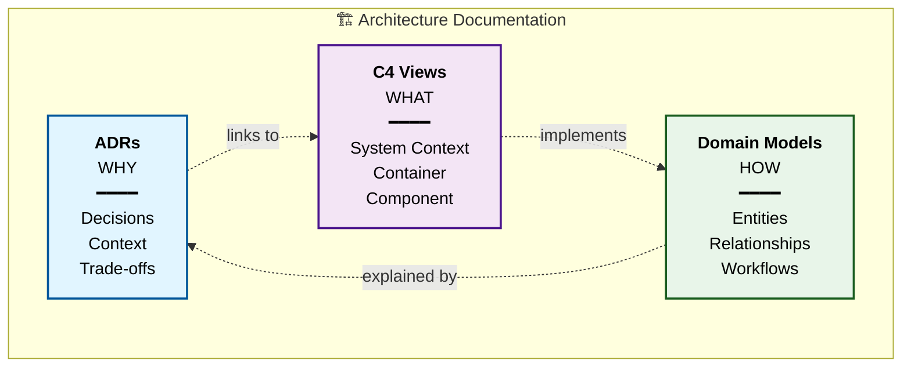
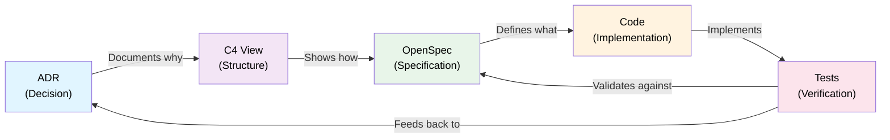
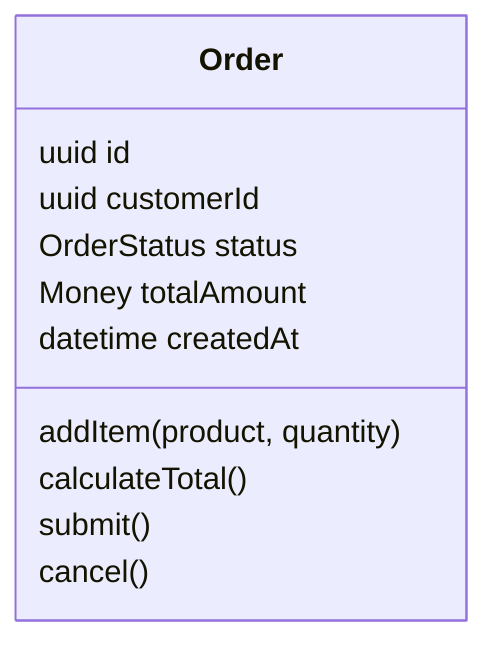
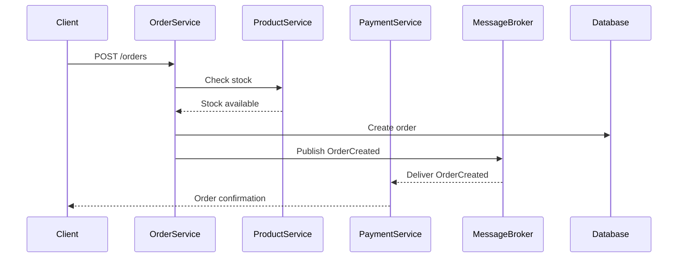

# 🏗️ Architecture as Code: Complete Example

[](https://opensource.org/licenses/MIT)
[](https://github.com/flemming-n-larsen/architecture-as-code-example)
[](./CONTRIBUTING.md)
[](https://www.markdownguide.org/)

An example demonstrating how to structure and maintain architecture documentation **as code** in your repository.
This approach combines Architecture Decision Records (ADRs), C4 diagrams, and domain models—all as plain text,
version-controlled, and AI-readable.

> **📖 Full Documentation:** See the [Architecture Hub](docs/architecture/README.md) for a complete overview of all architectural artifacts.

---

## 📰 Article Series

This repository accompanies this article series:

| # | Article                                                                                                                                                    | Description                                                    |
|:--|:-----------------------------------------------------------------------------------------------------------------------------------------------------------|:---------------------------------------------------------------|
| 1 | [Keep Your Architecture Diagrams in Code, Not in Tools](.articles/1.%20Keep%20Your%20Architecture%20Diagrams%20in%20Code%2C%20Not%20in%20Tools/README.md) | Why and how to store diagrams as plain text in your repo       |
| 2 | [Keep Your AI and Architecture/Design in Sync](.articles/2.%20Keep%20Your%20AI%20and%20Architecture-Design%20in%20Sync/README.md)                         | Spec-driven development so AI agents respect your architecture |
| 3 | [Architecture as Code in Practice](.articles/3.%20Architecture%20as%20Code%20in%20Practice/README.md)                                                     | ADRs, C4 diagrams, and domain models working together          |

---

## 📑 Table of Contents

- [🎯 What This Repository Demonstrates](#-what-this-repository-demonstrates)
- [📂 Repository Structure](#-repository-structure)
- [🏗️ The Three-Pillar Approach](#-the-three-pillar-approach)
- [📚 Documentation Structure](#-documentation-structure)
- [🔄 OpenSpec Integration](#-beyond-architecture-openspec-integration)
- [📖 Real Examples](#-real-examples-from-this-repository)
- [🛠️ Using This Repository](#-using-this-repository)
- [📝 Making Changes](#-making-changes)
- [📚 Related Resources](#-related-resources)
- [🤝 Contributing](#-contributing)
- [🚀 Get Started](#-get-started)

---

## 🎯 What This Repository Demonstrates

A complete working example of **executable architecture**—documentation that lives with your code, guides
implementation, and stays synchronized as your system evolves.

### The Three Pillars

```
architecture/
├── adr/                    # WHY: Architecture Decision Records
│   └── 0001-use-uuid-primary-keys.md
├── c4-views/               # WHAT: System structure at multiple zoom levels
│   └── system-context.md
└── models/                 # HOW: Domain entities and business flows
    ├── domain/order.md
    └── flows/create-order.md
```

**ADRs** document *why* decisions were made, **C4 diagrams** show *what* the system looks like, and **domain models**
explain *how* entities relate and workflows execute.

### 🔗 Quick Links

| Category           | Link                                                           | Description                                 |
|:-------------------|:---------------------------------------------------------------|:--------------------------------------------|
| **ADRs**           | [architecture/adr/](docs/architecture/adr/README.md)           | Architecture Decision Records (MADR format) |
| **C4 Views**       | [architecture/c4-views/](docs/architecture/c4-views/README.md) | System diagrams at multiple zoom levels     |
| **Domain Models**  | [architecture/models/](docs/architecture/models/README.md)     | Entity and workflow documentation           |
| **Specifications** | [openspec/](./openspec/README.md)                              | Detailed behavior specifications            |
| **User Stories**   | [docs/user-stories/](./docs/user-stories/README.md)            | Feature backlog                             |
| **AI Guidelines**  | [AGENTS.md](./AGENTS.md)                                       | Guidelines for AI agents                    |

---

## 📂 Repository Structure

```
├── .articles/                        # 📰 Article series (read-only reference)
├── .github/                          # GitHub Actions and workflows
├── .tools/                           # Development tooling and scripts
├── AGENTS.md                         # AI agent guidelines
├── CONTRIBUTING.md                   # Contribution guidelines
├── architecture/                     # ⭐ Core: Three-pillar architecture documentation
│   ├── adr/                          # Architecture Decision Records (WHY)
│   │   ├── 0001-use-uuid-primary-keys.md
│   │   ├── 0002-microservices-architecture.md
│   │   └── 0003-event-driven-communication.md
│   ├── c4-views/                     # C4 Model diagrams (WHAT)
│   │   ├── structurizr-dsl/          # DSL source files
│   │   ├── images/                   # Generated SVG diagrams
│   │   ├── system-context.md
│   │   ├── container.md
│   │   ├── order-service-component.md
│   │   └── payment-service-component.md
│   └── models/                       # Domain models and flows (HOW)
│       ├── domain/                   # Entity diagrams
│       │   ├── customer.md
│       │   ├── order.md
│       │   ├── product.md
│       │   └── payment.md
│       └── flows/                    # Business workflows
│           ├── create-order.md
│           ├── payment-processing.md
│           └── inventory-management.md
├── docs/                             # Additional documentation
│   ├── requirements.md
│   └── user-stories/
├── openspec/                         # Specifications (OpenSpec structure)
│   ├── specs/                        # Source of truth specifications
│   └── changes/                      # Active and archived change proposals
├── screenshots/                      # Visual documentation assets
├── src/                              # Application code
└── tests/                            # Test suites
```

---

## 🏗️ The Three-Pillar Approach


```mermaid
graph TB
    subgraph Architecture["🏗️ Architecture Documentation"]
        ADRs["<b>ADRs</b><br/>WHY<br/>━━━━<br/>Decisions<br/>Context<br/>Trade-offs"]
        C4Views["<b>C4 Views</b><br/>WHAT<br/>━━━━<br/>System Context<br/>Container<br/>Component"]
        Models["<b>Domain Models</b><br/>HOW<br/>━━━━<br/>Entities<br/>Relationships<br/>Workflows"]
    end

    ADRs -.->|links to| C4Views
    C4Views -.->|implements| Models
    Models -.->|explained by| ADRs

    style ADRs fill:#e1f5ff,stroke:#01579b,stroke-width:2px,color:#000
    style C4Views fill:#f3e5f5,stroke:#4a148c,stroke-width:2px,color:#000
    style Models fill:#e8f5e9,stroke:#1b5e20,stroke-width:2px,color:#000
```

---

### 1. Architecture Decision Records (ADRs) — The "Why"

**[👉 architecture/adr/](docs/architecture/adr/README.md)**

ADRs capture the context, alternatives, and rationale behind architectural decisions. Six months from now, when someone
asks "Why did we choose UUIDs instead of auto-increment IDs?", the answer is in an ADR—not lost in Slack.

**Example:** [ADR-0001: Use UUID Primary Keys](docs/architecture/adr/0001-use-uuid-primary-keys.md)

Each ADR includes: decision status, context, options considered with trade-offs, decision rationale, and consequences.

**Format:** [MADR (Markdown ADR)](https://adr.github.io/madr/) for consistency and AI-readability.

---

### 2. C4 Views — The "What"

**[👉 architecture/c4-views/](docs/architecture/c4-views/README.md)**

C4 diagrams show the system structure at multiple zoom levels:

- **Level 1:** [System Context](docs/architecture/c4-views/system-context.md) — The system, its users, and external dependencies
- **Level 2:** [Container View](docs/architecture/c4-views/container.md) — Major services, databases, and communication
- **Level 3:** [Component Views](docs/architecture/c4-views/order-service-component.md) — Internal structure of specific services

**Format:** [Structurizr DSL](https://structurizr.com/)—plain text with C4-native semantics.

---

### 3. Domain Models & Flows — The "How"

**[👉 architecture/models/](docs/architecture/models/README.md)**

**Domain Entities:** [Customer](docs/architecture/models/domain/customer.md) · [Order](docs/architecture/models/domain/order.md) · [Product](docs/architecture/models/domain/product.md) · [Payment](docs/architecture/models/domain/payment.md)

**Business Flows:** [Create Order](docs/architecture/models/flows/create-order.md) · [Payment Processing](docs/architecture/models/flows/payment-processing.md) · [Inventory Management](docs/architecture/models/flows/inventory-management.md)

**Format:** [Mermaid](https://mermaid.js.org/)—embeds directly in Markdown, renders everywhere.

---

## 📚 Documentation Structure

- **[Architecture Hub](docs/architecture/README.md)** — Start here for the complete architecture overview
- **[Requirements](docs/requirements.md)** — Functional and non-functional requirements
- **[User Stories](docs/user-stories/README.md)** — Feature backlog with acceptance criteria

### 🎯 Quick Start Paths

**New to the project?** [System Context](docs/architecture/c4-views/system-context.md) → [Container View](docs/architecture/c4-views/container.md) → [ADR-0002: Microservices](docs/architecture/adr/0002-microservices-architecture.md)

**Want to understand a feature?** [Create Order Flow](docs/architecture/models/flows/create-order.md) → [Order Model](docs/architecture/models/domain/order.md) → Related ADRs

**Looking for past decisions?** Browse the [ADR index](docs/architecture/adr/README.md)

---

## 🔄 Beyond Architecture: OpenSpec Integration

This repository also demonstrates **OpenSpec**—a complementary approach for managing detailed specifications and change
proposals with AI agents.

| Component | Purpose | Examples |
|:----------|:--------|:---------|
| **Architecture** (this approach) | System structure, decisions, and design | ADRs, C4 diagrams, domain models |
| **OpenSpec** (complementary) | Detailed behavior specifications and change management | API contracts, business rules, validation logic |


```mermaid
graph LR
    ADR["ADR<br/>(Decision)"] -->|Documents why| C4["C4 View<br/>(Structure)"]
    C4 -->|Shows how| OpenSpec["OpenSpec<br/>(Specification)"]
    OpenSpec -->|Defines what| Code["Code<br/>(Implementation)"]
    Code -->|Implements| Tests["Tests<br/>(Verification)"]
    Tests -->|Validates against| OpenSpec
    Tests -->|Feeds back to| ADR

    style ADR fill:#e1f5ff,color:#000
    style C4 fill:#f3e5f5,color:#000
    style OpenSpec fill:#e8f5e9,color:#000
    style Code fill:#fff3e0,color:#000
    style Tests fill:#fce4ec,color:#000
```

- **Specifications (in `/openspec/specs`) — Current system behavior (source of truth)
- **Change Proposals(in `/openspec/changes`) — Proposed changes with tasks and spec deltas
- **[AGENTS.md](./AGENTS.md)** — Guidelines for AI agents working with specs and code

> For a deep dive into the AI + architecture sync workflow, see [Article 2](.articles/2.%20Keep%20Your%20AI%20and%20Architecture-Design%20in%20Sync/README.md).

---

## 📖 Real Examples from This Repository

### ADR Example

From [architecture/adr/0001-use-uuid-primary-keys.md](docs/architecture/adr/0001-use-uuid-primary-keys.md):

```markdown
# Use UUIDs for Primary Keys

* Status: accepted
* Date: 2026-01-12
* Deciders: Architecture Team

## Decision Outcome

Chosen: UUIDs (v4)

### Consequences

✅ Services generate IDs locally with no coordination
✅ Safe merging/importing of data between environments
❌ Larger storage and index size vs integers
❌ Less human-friendly in logs (mitigation: short aliases)
```

---

### C4 View Example

From [architecture/c4-views/container.md](docs/architecture/c4-views/container.md):


Key elements: Web App (React + TypeScript), API Gateway, Microservices (Customer, Order, Product, Payment),
RabbitMQ message broker for event-driven communication, PostgreSQL databases per service.

---

### Domain Model Example

From [architecture/models/domain/order.md](docs/architecture/models/domain/order.md):


```mermaid
classDiagram
    class Order {
        uuid id
        uuid customerId
        OrderStatus status
        Money totalAmount
        datetime createdAt
        addItem(product, quantity)
        calculateTotal()
        submit()
        cancel()
    }
```

---

### Workflow Example

From [architecture/models/flows/create-order.md](docs/architecture/models/flows/create-order.md):


```mermaid
sequenceDiagram
    participant Client
    participant OrderService
    participant ProductService
    participant PaymentService
    participant MessageBroker
    Client ->> OrderService: POST /orders
    OrderService ->> ProductService: Check stock
    ProductService -->> OrderService: Stock available
    OrderService ->> Database: Create order
    OrderService ->> MessageBroker: Publish OrderCreated
    MessageBroker -->> PaymentService: Deliver OrderCreated
    PaymentService -->> Client: Order confirmation
```

---

## 🛠️ Using This Repository

### Prerequisites (Optional)

| Tool | Purpose | Installation |
|:-----|:--------|:-------------|
| [Structurizr CLI](https://github.com/structurizr/cli) | Generate C4 diagrams from DSL | `brew install structurizr-cli` or download from GitHub |
| [Mermaid CLI](https://github.com/mermaid-js/mermaid-cli) | Export Mermaid diagrams to images | `npm install -g @mermaid-js/mermaid-cli` |

> Most IDEs, GitHub, and GitLab render Mermaid diagrams natively—no CLI needed for viewing.

### For Your Own Project

1. **Fork or clone** this repository as a template
2. Replace example ADRs with your real architectural decisions
3. Update C4 DSL files with your actual system structure
4. Customize domain models for your business entities
5. Commit architecture updates in the same PR as implementation changes

---

## 📝 Making Changes

When making architectural changes, follow this pattern:

**1. Document the Decision:**

```bash
cp architecture/adr/0001-use-uuid-primary-keys.md architecture/adr/0004-new-decision.md
edit architecture/adr/0004-new-decision.md
```

**2. Update Structure Views:**

```bash
edit architecture/c4-views/structurizr-dsl/container.dsl
structurizr-cli export -workspace container.dsl -format svg
```

**3. Update Domain Models:**

```bash
edit architecture/models/domain/order.md
edit architecture/models/flows/create-order.md
```

**4. Commit Everything Together:**

```bash
git add architecture/ src/
git commit -m "feat: add order cancellation workflow

- ADR-0004: Document decision to support cancellations
- Update container view with new CancellationService
- Add cancellation flow sequence diagram
- Implement OrderService.cancelOrder() method"
```

This keeps architecture and implementation synchronized and reviewable in the same PR.

---

## 📚 Related Resources

### Article Series

| # | Article |
|:--|:--------|
| 1 | [Keep Your Architecture Diagrams in Code, Not in Tools](.articles/1.%20Keep%20Your%20Architecture%20Diagrams%20in%20Code%2C%20Not%20in%20Tools/README.md) |
| 2 | [Keep Your AI and Architecture/Design in Sync](.articles/2.%20Keep%20Your%20AI%20and%20Architecture-Design%20in%20Sync/README.md) |
| 3 | [Architecture as Code in Practice](.articles/3.%20Architecture%20as%20Code%20in%20Practice/README.md) |

### Architecture Decision Records

- **[ADR.github.io](https://adr.github.io/)** — Official ADR documentation and templates
- **[MADR](https://adr.github.io/madr/)** — Markdown ADR format (used in this repo)
- **[Documenting Architecture Decisions](https://cognitect.com/blog/2011/11/15/documenting-architecture-decisions)** — Original Michael Nygard article

### C4 Model

- **[C4 Model](https://c4model.com/)** — Official C4 documentation
- **[Structurizr](https://structurizr.com/)** — C4 tooling and DSL
- **[Structurizr DSL Reference](https://github.com/structurizr/dsl/wiki/Language-Reference)**
- **[Structurizr Playground](https://playground.structurizr.com/)** — Online DSL editor

### Mermaid Diagrams

- **[Mermaid.js](https://mermaid.js.org/)** — Diagram syntax and documentation
- **[Mermaid Live Editor](https://mermaid.live)** — Interactive editor and export tool

### Architecture Patterns

- **[Domain-Driven Design](https://www.domainlanguage.com/ddd/)** — Eric Evans' foundational work
- **[Fitness Functions](https://www.thoughtworks.com/insights/articles/fitness-function-driven-development)** — Verifying architecture through automated checks

### OpenSpec

- **[OpenSpec](https://openspec.dev/)** — Machine-readable specifications (used in this repo for detailed specs)

---

## 🤝 Contributing

This is an educational example repository demonstrating the Architecture as Code approach.

- **Share your experience** — Open an issue describing how you adapted this approach
- **Suggest improvements** — Submit issues for clarifications or enhancements
- **Report issues** — If you find broken links or unclear documentation
- **Fork and adapt** — Customize this structure for your organization and share learnings

## 📄 License

MIT License — Free to use and adapt for any purpose. See [LICENSE](./LICENSE) for details.

---

## 🚀 Get Started

1. 🏗️ **Start:** [architecture/README.md](docs/architecture/README.md) — Architecture hub overview
2. 🔍 **Explore:** [architecture/](docs/architecture/README.md) — See the three pillars in action
3. 📖 **Read:** Pick an article from the [series](#-article-series) for background context
4. 💡 **Adapt:** Fork this repo and customize for your project

**Questions or feedback?** Open an issue or discussion—we'd love to hear how you're using this approach!

---

**⭐ If this repository helps you, please star it to help others discover architecture-as-code!**
