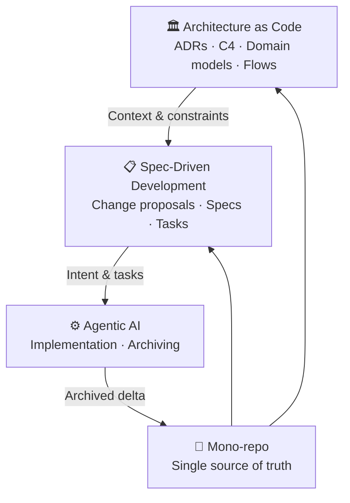
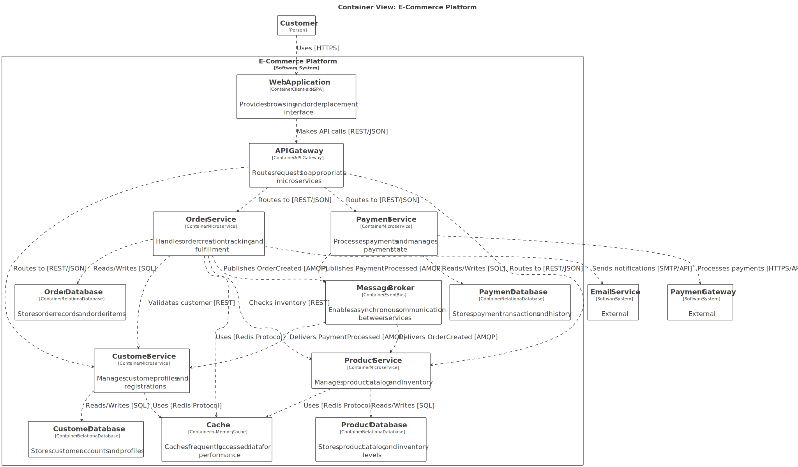
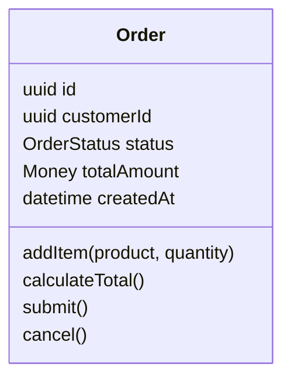
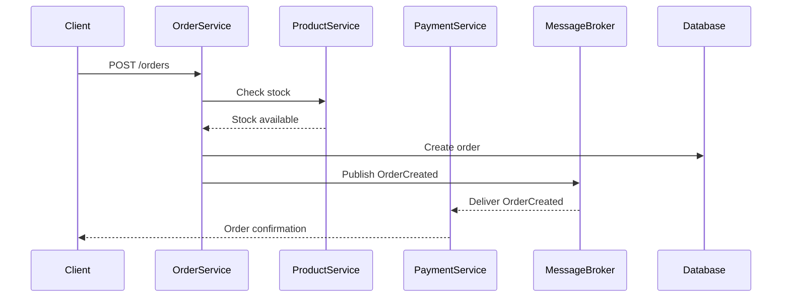

# 🏗️ Architecture as Code: Complete Example

[](https://opensource.org/licenses/MIT)
[](https://github.com/flemming-n-larsen/architecture-as-code-example)
[](./CONTRIBUTING.md)
[](https://www.markdownguide.org/)

An example demonstrating how to develop software in the agentic AI age across three layers:
**Architecture as Code** (AoC) · **Spec-Driven Development** (SDD) · **Agentic AI** implementation—all as plain text,
version-controlled, and AI-readable.

> **📖 Full Documentation:** See the [Architecture Hub](docs/architecture/README.md) for a complete overview of all architectural artifacts.

---

## 📰 Article Series

This repository accompanies this article series:

| # | Article                                                                                                                                                   | Description                                                         |
|:--|:----------------------------------------------------------------------------------------------------------------------------------------------------------|:--------------------------------------------------------------------|
| 1 | [Keep Your Architecture Diagrams in Code, Not in Tools](.articles/1.%20Keep%20Your%20Architecture%20Diagrams%20in%20Code%2C%20Not%20in%20Tools/README.md) | Why and how to store diagrams as plain text in your repo            |
| 2 | [Keep Your AI and Architecture/Design in Sync](.articles/2.%20Keep%20Your%20AI%20and%20Architecture-Design%20in%20Sync/README.md)                         | Spec-driven development so AI agents respect your architecture      |
| 3 | [Architecture as Code in Practice](.articles/3.%20Architecture%20as%20Code%20in%20Practice/README.md)                                                     | ADRs, C4 diagrams, and domain models working together               |
| 4 | [Think in Specs — The Modern Developer's Mindset](.articles/4.%20Think%20in%20Specs%20-%20The%20Modern%20Developers%20Mindset/README.md)                  | The mindset that ties architecture, design, and agentic AI together |

---

## 📑 Table of Contents

- [🎯 What This Repository Demonstrates](#-what-this-repository-demonstrates)
- [📂 Repository Structure](#-repository-structure)
- [🏗️ The Complete Workflow](#-the-complete-workflow)
- [📚 Documentation Structure](#-documentation-structure)
- [🔄 OpenSpec Integration](#-beyond-architecture-openspec-integration)
- [📖 Real Examples](#-real-examples-from-this-repository)
- [🛠️ Using This Repository](#-using-this-repository)
- [📝 Making Changes](#-making-changes)
- [📚 Related Resources](#-related-resources)
- [🤝 Contributing](#-contributing)
- [🚀 Get Started](#-get-started)

---

## 🎯 What This Repository Demonstrates

Software development still moves through three layers — AI changes *who* does the implementation, not the layers themselves:

| Layer | Practice | What lives here |
|:------|:---------|:----------------|
| **🏛️ Architecture** | Architecture as Code (AoC) | ADRs, C4 diagrams, domain models, flows, IaC specs |
| **📋 Design** | [Spec-Driven Development (SDD)](https://en.wikipedia.org/wiki/Spec-driven_development) | Change proposals, specs, tasks |
| **⚙️ Implementation** | Agentic AI | Code — written by the AI from the spec |

> **Key insight:** AI is excellent at implementation. Humans are still required for architecture and design.
> See the [article series](#-article-series) for the full mindset behind this approach.

### 🏗️ The Four Pillars of Architecture as Code

```
architecture/
├── adr/                    # WHY:             Architecture Decision Records
│   └── 0001-use-uuid-primary-keys.md
├── c4-views/               # WHAT:            System structure at multiple zoom levels
│   └── system-context.md
├── models/                 # HOW:             Domain entities and business flows
│   ├── domain/order.md
│   └── flows/create-order.md
└── iac/                    # WHERE/GUARDRAILS: Infrastructure specs and environment policy
    ├── networking.md
    ├── iam.md
    └── environments.md
```

**ADRs** document *why* decisions were made, **C4 diagrams** show *what* the system looks like, **domain models**
explain *how* entities relate and workflows execute, and **IaC specs** define *where* the system runs and what
guardrails govern it.

### 🔗 Quick Links

| Category           | Link                                                           | Description                                 |
|:-------------------|:---------------------------------------------------------------|:--------------------------------------------|
| **ADRs**           | [architecture/adr/](docs/architecture/adr/README.md)           | Architecture Decision Records (MADR format) |
| **C4 Views**       | [architecture/c4-views/](docs/architecture/c4-views/README.md) | System diagrams at multiple zoom levels     |
| **Domain Models**  | [architecture/models/](docs/architecture/models/README.md)     | Entity and workflow documentation           |
| **IaC Specs**      | [architecture/iac/](docs/architecture/iac/README.md)           | Networking, IAM, and environment guardrails |
| **Specifications** | [openspec/](./openspec/README.md)                              | Detailed behavior specifications            |
| **User Stories**   | [docs/user-stories/](./docs/user-stories/README.md)            | Feature backlog                             |
| **AI Guidelines**  | [AGENTS.md](./AGENTS.md)                                       | Guidelines for AI agents                    |

---

## 📂 Repository Structure

```
├── .articles/                        # 📰 Article series (read-only reference)
├── .github/                          # GitHub Actions and workflows
├── .tools/                           # Development tooling and scripts
├── AGENTS.md                         # AI agent guidelines
├── CONTRIBUTING.md                   # Contribution guidelines
├── architecture/                     # ⭐ Core: Four-pillar architecture documentation
│   ├── adr/                          # Architecture Decision Records (WHY)
│   │   ├── 0001-use-uuid-primary-keys.md
│   │   ├── 0002-microservices-architecture.md
│   │   └── 0003-event-driven-communication.md
│   ├── c4-views/                     # C4 Model diagrams (WHAT)
│   │   ├── structurizr-dsl/          # DSL source files
│   │   ├── images/                   # Generated SVG diagrams
│   │   ├── system-context.md
│   │   ├── container.md
│   │   ├── order-service-component.md
│   │   └── payment-service-component.md
│   ├── models/                       # Domain models and flows (HOW)
│   │   ├── domain/                   # Entity diagrams
│   │   │   ├── customer.md
│   │   │   ├── order.md
│   │   │   ├── product.md
│   │   │   └── payment.md
│   │   └── flows/                    # Business workflows
│   │       ├── create-order.md
│   │       ├── payment-processing.md
│   │       └── inventory-management.md
│   └── iac/                          # Infrastructure specs (WHERE/GUARDRAILS)
│       ├── networking.md             # VPC topology and security groups
│       ├── iam.md                    # Per-service roles and least-privilege policies
│       └── environments.md          # Dev / staging / prod guardrails
├── docs/                             # Additional documentation
│   ├── requirements.md
│   └── user-stories/
├── openspec/                         # Specifications (OpenSpec structure)
│   ├── specs/                        # Source of truth specifications
│   └── changes/                      # Active and archived change proposals
├── screenshots/                      # Visual documentation assets
├── src/                              # Application code
└── tests/                            # Test suites
```

---

## 🏗️ The Complete Workflow

AoC + SDD + Agentic AI form a closed loop — the mono-repo is the single source of truth:


```mermaid
graph TD
    AoC["🏛️ Architecture as Code<br>ADRs · C4 · Domain models · Flows"]
    SDD["📋 Spec-Driven Development<br>Change proposals · Specs · Tasks"]
    AI["⚙️ Agentic AI<br>Implementation · Archiving"]
    Repo["📜 Mono-repo<br>Single source of truth"]

    Repo --> AoC
    Repo --> SDD
    AoC -->|"Context & constraints"| SDD
    SDD -->|"Intent & tasks"| AI
    AI -->|"Archived delta"| Repo
```

---

### 1. Architecture Decision Records (ADRs) — The "Why"

**[👉 architecture/adr/](docs/architecture/adr/README.md)**

ADRs capture the context, alternatives, and rationale behind architectural decisions. Six months from now, when someone
asks "Why did we choose UUIDs instead of auto-increment IDs?", the answer is in an ADR—not lost in Slack.

**Example:** [ADR-0001: Use UUID Primary Keys](docs/architecture/adr/0001-use-uuid-primary-keys.md)

Each ADR includes: decision status, context, options considered with trade-offs, decision rationale, and consequences.

**Format:** [MADR (Markdown ADR)](https://adr.github.io/madr/) for consistency and AI-readability.

---

### 2. C4 Views — The "What"

**[👉 architecture/c4-views/](docs/architecture/c4-views/README.md)**

C4 diagrams show the system structure at multiple zoom levels:

- **Level 1:** [System Context](docs/architecture/c4-views/system-context.md) — The system, its users, and external dependencies
- **Level 2:** [Container View](docs/architecture/c4-views/container.md) — Major services, databases, and communication
- **Level 3:** [Component Views](docs/architecture/c4-views/order-service-component.md) — Internal structure of specific services

**Format:** [Structurizr DSL](https://structurizr.com/)—plain text with C4-native semantics.

---

### 3. Domain Models & Flows — The "How"

**[👉 architecture/models/](docs/architecture/models/README.md)**

**Domain Entities:** [Customer](docs/architecture/models/domain/customer.md) · [Order](docs/architecture/models/domain/order.md) · [Product](docs/architecture/models/domain/product.md) · [Payment](docs/architecture/models/domain/payment.md)

**Business Flows:** [Create Order](docs/architecture/models/flows/create-order.md) · [Payment Processing](docs/architecture/models/flows/payment-processing.md) · [Inventory Management](docs/architecture/models/flows/inventory-management.md)

**Format:** [Mermaid](https://mermaid.js.org/)—embeds directly in Markdown, renders everywhere.

---

### 4. Infrastructure as Code Specs — The "Where & Guardrails"

**[👉 architecture/iac/](docs/architecture/iac/README.md)**

IaC files are not just automation scripts — they are version-controlled contracts for your environment. Treating
them as specs means they live in the repo alongside ADRs and C4 diagrams, and can be reviewed, linted, and enforced
*before* anything hits a pipeline. See [Microsoft: What is Infrastructure as Code?](https://learn.microsoft.com/en-us/devops/deliver/what-is-infrastructure-as-code).

- **[Networking](docs/architecture/iac/networking.md)** — VPC topology, subnets, and per-service security-group rules
- **[IAM](docs/architecture/iac/iam.md)** — Per-service roles, least-privilege policies, and RabbitMQ permissions
- **[Environments](docs/architecture/iac/environments.md)** — Dev / staging / prod definitions and promotion guardrails

**Format:** Markdown specs (cloud-agnostic) — acts as the human-readable contract that Terraform / Bicep / Pulumi files implement.

---

## 📚 Documentation Structure

- **[Architecture Hub](docs/architecture/README.md)** — Start here for the complete architecture overview
- **[Requirements](docs/requirements.md)** — Functional and non-functional requirements
- **[User Stories](docs/user-stories/README.md)** — Feature backlog with acceptance criteria

### 🎯 Quick Start Paths

**New to the project?** [System Context](docs/architecture/c4-views/system-context.md) → [Container View](docs/architecture/c4-views/container.md) → [ADR-0002: Microservices](docs/architecture/adr/0002-microservices-architecture.md)

**Want to understand a feature?** [Create Order Flow](docs/architecture/models/flows/create-order.md) → [Order Model](docs/architecture/models/domain/order.md) → Related ADRs

**Looking for past decisions?** Browse the [ADR index](docs/architecture/adr/README.md)

**Deploying or reviewing infra?** [Networking](docs/architecture/iac/networking.md) → [IAM](docs/architecture/iac/iam.md) → [Environments](docs/architecture/iac/environments.md)

---

## 🔄 Beyond Architecture: OpenSpec Integration

**OpenSpec** complements AoC with [Spec-Driven Development](https://en.wikipedia.org/wiki/Spec-driven_development):
write a change proposal before any code is written, let an AI implement task by task from the spec, then archive the
delta back into the specs. The workflow is deliberately front-loaded — design issues surface when they are inexpensive to fix.

| Component        | Purpose                                       | Examples                                           |
|:-----------------|:----------------------------------------------|:---------------------------------------------------|
| **Architecture** | System structure, decisions, and design       | ADRs, C4 diagrams, domain models                   |
| **OpenSpec**     | Detailed behavior specs and change management | Change proposals, business rules, validation logic |

- **`/openspec/specs/`** — Source-of-truth specifications per domain
- **`/openspec/changes/`** — Active and archived change proposals (`proposal.md`, `tasks.md`, spec deltas)
- **[AGENTS.md](./AGENTS.md)** — Guidelines for AI agents working with specs and code

> For the full SDD workflow (steps, prompts, and a worked example), see [Article 2](.articles/2.%20Keep%20Your%20AI%20and%20Architecture-Design%20in%20Sync/README.md).
> For the mindset behind combining AoC + SDD + Agentic AI, see [Article 4](.articles/4.%20Think%20in%20Specs%20-%20The%20Modern%20Developers%20Mindset/README.md).

---

## 📖 Real Examples from This Repository

### ADR Example

From [architecture/adr/0001-use-uuid-primary-keys.md](docs/architecture/adr/0001-use-uuid-primary-keys.md):

```markdown
# Use UUIDs for Primary Keys

* Status: accepted
* Date: 2026-01-12
* Deciders: Architecture Team

## Decision Outcome

Chosen: UUIDs (v4)

### Consequences

✅ Services generate IDs locally with no coordination
✅ Safe merging/importing of data between environments
❌ Larger storage and index size vs integers
❌ Less human-friendly in logs (mitigation: short aliases)
```

---

### C4 View Example

From [architecture/c4-views/container.md](docs/architecture/c4-views/container.md):



Key elements: Web App (React + TypeScript), API Gateway, Microservices (Customer, Order, Product, Payment),
RabbitMQ message broker for event-driven communication, PostgreSQL databases per service.

---

### Domain Model Example

From [architecture/models/domain/order.md](docs/architecture/models/domain/order.md):


```mermaid
classDiagram
    class Order {
        uuid id
        uuid customerId
        OrderStatus status
        Money totalAmount
        datetime createdAt
        addItem(product, quantity)
        calculateTotal()
        submit()
        cancel()
    }
```

---

### Workflow Example

From [architecture/models/flows/create-order.md](docs/architecture/models/flows/create-order.md):


```mermaid
sequenceDiagram
    participant Client
    participant OrderService
    participant ProductService
    participant PaymentService
    participant MessageBroker
    Client ->> OrderService: POST /orders
    OrderService ->> ProductService: Check stock
    ProductService -->> OrderService: Stock available
    OrderService ->> Database: Create order
    OrderService ->> MessageBroker: Publish OrderCreated
    MessageBroker -->> PaymentService: Deliver OrderCreated
    PaymentService -->> Client: Order confirmation
```

---

## 🛠️ Using This Repository

### Prerequisites (Optional)

| Tool                                                     | Purpose                           | Installation                                           |
|:---------------------------------------------------------|:----------------------------------|:-------------------------------------------------------|
| [Structurizr CLI](https://github.com/structurizr/cli)    | Generate C4 diagrams from DSL     | `brew install structurizr-cli` or download from GitHub |
| [Mermaid CLI](https://github.com/mermaid-js/mermaid-cli) | Export Mermaid diagrams to images | `npm install -g @mermaid-js/mermaid-cli`               |

> Most IDEs, GitHub, and GitLab render Mermaid diagrams natively—no CLI needed for viewing.

### For Your Own Project

1. **Fork or clone** this repository as a template
2. Replace example ADRs with your real architectural decisions
3. Update C4 DSL files with your actual system structure
4. Customize domain models for your business entities
5. Commit architecture updates in the same PR as implementation changes

---

## 📝 Making Changes

Follow the SDD workflow — front-load the thinking, let the AI do the implementation:

1. **Write a change proposal** (`proposal.md`, `tasks.md`) — with AI in plan mode
2. **Review & refine** — human judgment, don't skip this
3. **Implement task by task** — AI works from the spec
4. **Archive & merge** — AI archives the spec delta, open the PR

> For detailed steps, prompts, and a worked example, see [Article 2](.articles/2.%20Keep%20Your%20AI%20and%20Architecture-Design%20in%20Sync/README.md).

---

## 📚 Related Resources

### Article Series

| # | Article                                                                                                                                                   |
|:--|:----------------------------------------------------------------------------------------------------------------------------------------------------------|
| 1 | [Keep Your Architecture Diagrams in Code, Not in Tools](.articles/1.%20Keep%20Your%20Architecture%20Diagrams%20in%20Code%2C%20Not%20in%20Tools/README.md) |
| 2 | [Keep Your AI and Architecture/Design in Sync](.articles/2.%20Keep%20Your%20AI%20and%20Architecture-Design%20in%20Sync/README.md)                         |
| 3 | [Architecture as Code in Practice](.articles/3.%20Architecture%20as%20Code%20in%20Practice/README.md)                                                     |
| 4 | [Think in Specs — The Modern Developer's Mindset](.articles/4.%20Think%20in%20Specs%20-%20The%20Modern%20Developers%20Mindset/README.md)                  |

### OpenSpec & Spec-Driven Development

- **[OpenSpec](https://openspec.dev/)** — Machine-readable specifications (used in this repo for detailed specs)
- **[Spec-Driven Development — Wikipedia](https://en.wikipedia.org/wiki/Spec-driven_development)** — Overview of the SDD methodology

### Architecture Decision Records

- **[ADR.github.io](https://adr.github.io/)** — Official ADR documentation and templates
- **[MADR](https://adr.github.io/madr/)** — Markdown ADR format (used in this repo)
- **[Documenting Architecture Decisions](https://cognitect.com/blog/2011/11/15/documenting-architecture-decisions)** — Original Michael Nygard article

### C4 Model

- **[C4 Model](https://c4model.com/)** — Official C4 documentation
- **[Structurizr](https://structurizr.com/)** — C4 tooling and DSL
- **[Structurizr DSL Reference](https://github.com/structurizr/dsl/wiki/Language-Reference)**
- **[Structurizr Playground](https://playground.structurizr.com/)** — Online DSL editor

### Mermaid Diagrams

- **[Mermaid.js](https://mermaid.js.org/)** — Diagram syntax and documentation
- **[Mermaid Live Editor](https://mermaid.live)** — Interactive editor and export tool

### Architecture Patterns

- **[Domain-Driven Design](https://www.domainlanguage.com/ddd/)** — Eric Evans' foundational work
- **[Fitness Functions](https://www.thoughtworks.com/insights/articles/fitness-function-driven-development)** — Verifying architecture through automated checks


---

## 🤝 Contributing

This is an educational example repository demonstrating the Architecture as Code approach.

- **Share your experience** — Open an issue describing how you adapted this approach
- **Suggest improvements** — Submit issues for clarifications or enhancements
- **Report issues** — If you find broken links or unclear documentation
- **Fork and adapt** — Customize this structure for your organization and share learnings

## 📄 License

MIT License — Free to use and adapt for any purpose. See [LICENSE](./LICENSE) for details.

---

## 🚀 Get Started

1. 🏗️ **Start:** [architecture/README.md](docs/architecture/README.md) — Architecture hub overview
2. 🔍 **Explore:** [architecture/](docs/architecture/README.md) — See the four pillars in action
3. 📖 **Read:** Pick an article from the [series](#-article-series) for background context
4. 💡 **Adapt:** Fork this repo and customize for your project

**Questions or feedback?** Open an issue or discussion—we'd love to hear how you're using this approach!

---

**⭐ If this repository helps you, please star it to help others discover architecture-as-code!**
