# 🏗️ Architecture as Code: Complete Example

[](https://opensource.org/licenses/MIT)
[](https://github.com/flemming-n-larsen/architecture-as-code-example)
[](./CONTRIBUTING.md)
[](https://www.markdownguide.org/)

A production-ready example demonstrating how to structure and maintain architecture documentation **as code** in your
repository. This approach combines Architecture Decision Records (ADRs), C4 diagrams, and domain models—all as plain
text, version-controlled, and AI-readable.

> **📖 Full Documentation:** See the [Architecture Hub](./architecture/README.md) for a complete overview of all architectural artifacts.

---

## 📑 Table of Contents

- [🎯 What This Repository Demonstrates](#-what-this-repository-demonstrates)
- [✨ Why This Matters](#-why-this-matters)
- [📂 Repository Structure](#-repository-structure)
- [🏗️ The Three-Pillar Approach](#️-the-three-pillar-approach)
  - [1. ADRs — The "Why"](#1-architecture-decision-records-adrs--the-why)
  - [2. C4 Views — The "What"](#2-c4-views--the-what)
  - [3. Domain Models — The "How"](#3-domain-models--flows--the-how)
- [📚 Documentation Structure](#-documentation-structure)
- [🚀 How This Works in Practice](#-how-this-works-in-practice)
- [💡 Key Benefits](#-key-benefits)
- [🔄 OpenSpec Integration](#-beyond-architecture-openspec-integration)
- [🤖 OpenSpec Workflow](#-openspec-workflow)
- [📖 Real Examples](#-real-examples-from-this-repository)
- [🛠️ Using This Repository](#️-using-this-repository)
- [🎓 What You'll Learn](#-what-youll-learn)
- [📝 Making Changes](#-making-changes)
- [🌟 Philosophy](#-philosophy-executable-architecture)
- [📚 Related Resources](#-related-resources)
- [🤝 Contributing](#-contributing)
- [🚀 Get Started](#-get-started)

---

## 🎯 What This Repository Demonstrates

This is a complete working example of **executable architecture**—documentation that lives with your code, guides
implementation, and stays synchronized as your system evolves.

### The Three Pillars

```
architecture/
├── adr/                    # WHY: Architecture Decision Records
│   └── 0001-use-uuid-primary-keys.md
├── c4-views/               # WHAT: System structure at multiple zoom levels
│   └── system-context.md
└── models/                 # HOW: Domain entities and business flows
    ├── domain/order.md
    └── flows/create-order.md
```

**Three pillars:** ADRs document *why* decisions were made, C4 diagrams show *what* the system looks like at different
levels, and domain models explain *how* entities relate and workflows execute.

### 🔗 Quick Links

| Category | Link | Description |
|:---------|:-----|:------------|
| **ADRs** | [architecture/adr/](./architecture/adr/) | Architecture Decision Records |
| **C4 Views** | [architecture/c4-views/](./architecture/c4-views/) | System diagrams at multiple zoom levels |
| **Domain Models** | [architecture/models/](./architecture/models/) | Entity and workflow documentation |
| **Specifications** | [openspec/specs/](./openspec/specs/) | Detailed behavior specifications |
| **User Stories** | [docs/user-stories/](./docs/user-stories/) | Feature backlog |
| **AI Guidelines** | [AGENTS.md](./AGENTS.md) | Guidelines for AI agents |

## ✨ Why This Matters

Traditional architecture documentation fails because:

- **Decision Context Lost** — "Why did we choose this?" lives in Slack threads or someone's memory
- **Diagrams Out of Sync** — Visio/Confluence diagrams diverge from the actual implementation
- **Multiple Tools** — Architecture scattered across wikis, diagrams tools, and slide decks
- **Not Reviewable** — Can't diff architecture changes or review them in pull requests
- **AI Can't Help** — Proprietary formats lock out AI assistance

### This Approach Solves It

✅ **Plain Text in Git** — All architecture artifacts version-controlled with code  
✅ **Three-View Structure** — Decisions (ADRs), structure (C4), and models (domain/flows)  
✅ **AI-Readable** — Plain text enables AI agents to understand, validate, and improve architecture  
✅ **Reviewable** — Discuss architecture changes in pull requests alongside implementation  
✅ **Discoverable** — Searchable with grep, IDE search, or AI agents  
✅ **Scalable** — Modular structure grows with your system

## 📂 Repository Structure

```
├── .github/                          # GitHub Actions and workflows
├── .tools/                           # Development tooling and scripts
├── AGENTS.md                         # AI agent guidelines
├── CONTRIBUTING.md                   # Contribution guidelines
├── architecture/                     # ⭐ Core: Three-pillar architecture documentation
│   ├── adr/                          # Architecture Decision Records (WHY)
│   │   ├── 0001-use-uuid-primary-keys.md
│   │   ├── 0002-microservices-architecture.md
│   │   └── 0003-event-driven-communication.md
│   ├── c4-views/                     # C4 Model diagrams (WHAT)
│   │   ├── structurizr-dsl/          # DSL source files
│   │   ├── images/                   # Generated SVG diagrams
│   │   ├── system-context.md
│   │   ├── container.md
│   │   ├── order-service-component.md
│   │   └── payment-service-component.md
│   └── models/                       # Domain models and flows (HOW)
│       ├── domain/                   # Entity diagrams
│       │   ├── customer.md
│       │   ├── order.md
│       │   ├── product.md
│       │   └── payment.md
│       └── flows/                    # Business workflows
│           ├── create-order.md
│           ├── payment-processing.md
│           └── inventory-management.md
├── docs/                             # Additional documentation
│   ├── requirements.md
│   └── user-stories/
├── openspec/                         # Specifications (OpenSpec structure)
│   ├── specs/                        # Source of truth specifications
│   └── changes/                      # Active and archived change proposals
├── screenshots/                      # Visual documentation assets
├── src/                              # Application code
└── tests/                            # Test suites
```

## 🏗️ The Three-Pillar Approach

```mermaid
graph TB
    subgraph Architecture["🏗️ Architecture Documentation"]
        ADRs["<b>ADRs</b><br/>WHY<br/>━━━━<br/>Decisions<br/>Context<br/>Trade-offs"]
        C4Views["<b>C4 Views</b><br/>WHAT<br/>━━━━<br/>System Context<br/>Container<br/>Component"]
        Models["<b>Domain Models</b><br/>HOW<br/>━━━━<br/>Entities<br/>Relationships<br/>Workflows"]
    end
    
    ADRs -.->|links to| C4Views
    C4Views -.->|implements| Models
    Models -.->|explained by| ADRs
    
    style ADRs fill:#e1f5ff,stroke:#01579b,stroke-width:2px,color:#000
    style C4Views fill:#f3e5f5,stroke:#4a148c,stroke-width:2px,color:#000
    style Models fill:#e8f5e9,stroke:#1b5e20,stroke-width:2px,color:#000
```



---

### 1. Architecture Decision Records (ADRs) — The "Why"

**[→ architecture/adr/](./architecture/adr/)**

ADRs capture the context, alternatives, and rationale behind architectural decisions. Six months from now, when someone
asks "Why did we choose UUIDs instead of auto-increment IDs?", the answer is in an ADR—not lost in Slack.

**Example:** [ADR-0001: Use UUID Primary Keys](./architecture/adr/0001-use-uuid-primary-keys.md)

Each ADR includes:

- The decision and its status
- Context and problem statement
- Options considered with trade-offs
- Decision outcome and rationale
- Consequences (positive and negative)

**Format:** We use [MADR (Markdown ADR)](https://adr.github.io/madr/) for consistency and AI-readability.

---

### 2. C4 Views — The "What"

**[→ architecture/c4-views/](./architecture/c4-views/)**

C4 diagrams show the system structure at multiple zoom levels, like a map you can zoom in and out of:

- **Level 1: System Context** — The system, its users, and external dependencies (10,000-foot view)
- **Level 2: Container** — Major services, databases, and how they communicate (1,000-foot view)
- **Level 3: Component** — Internal structure of a specific service (100-foot view)
- **Level 4: Code** — Class-level detail (rarely needed; use domain models instead)

**Example Views:**

- [System Context](./architecture/c4-views/system-context.md) — E-commerce platform overview
- [Container View](./architecture/c4-views/container.md) — Microservices and databases
- [Order Service Components](./architecture/c4-views/order-service-component.md) — Internal service structure

**Format:** We use [Structurizr DSL](https://structurizr.com/) for C4 diagrams because it's plain text, has C4-native
semantics, and generates professional-looking SVGs.

---

### 3. Domain Models & Flows — The "How"

**[→ architecture/models/](./architecture/models/)**

Domain models explain entity relationships and how business processes are executed across the system:

**Domain Entities** (with Mermaid diagrams):

- [Customer](./architecture/models/domain/customer.md)
- [Order](./architecture/models/domain/order.md)
- [Product](./architecture/models/domain/product.md)
- [Payment](./architecture/models/domain/payment.md)

**Business Flows** (sequence diagrams):

- [Create Order Flow](./architecture/models/flows/create-order.md)
- [Payment Processing](./architecture/models/flows/payment-processing.md)
- [Inventory Management](./architecture/models/flows/inventory-management.md)

**Format:** We use [Mermaid](https://mermaid.js.org/) for domain models and sequence diagrams because it embeds directly
in Markdown and renders everywhere (GitHub, IDEs, documentation sites).

---

## 📚 Documentation Structure

The architecture documentation is organized for easy navigation:

- **[Architecture Hub](architecture/README.md)** — Start here for the complete architecture overview
- **[Requirements](docs/requirements.md)** — System requirements (functional and non-functional)
- **[User Stories](docs/user-stories/README.md)** — Feature backlog with acceptance criteria

### 🎯 Quick Start Paths

**New to the project?**

1. Read the [System Context](./architecture/c4-views/system-context.md) for the big picture
2. Explore the [Container View](./architecture/c4-views/container.md) to see microservices
3. Review [ADR-0002: Microservices Architecture](./architecture/adr/0002-microservices-architecture.md) to understand
   why

**Want to understand a specific feature?**

1. Check the [Create Order Flow](./architecture/models/flows/create-order.md) sequence diagram
2. Review the [Order](./architecture/models/domain/order.md) domain model
3. See the implementation rationale in related ADRs

**Looking to understand past decisions?**

- Browse all ADRs in the [ADR index](./architecture/adr/README.md)

---

## 🚀 How This Works in Practice

### 1. Decisions Drive Structure

When you make an architectural decision, document it as an ADR:

```markdown
# ADR-0003: Event-Driven Communication

* Status: accepted
* Deciders: Architecture Team

## Context and Problem Statement

How should microservices communicate asynchronously?

## Decision Outcome

Chosen: RabbitMQ message broker with event-driven patterns

### Consequences

✅ Loose coupling between services
✅ Better scalability and resilience
❌ Increased operational complexity
```

### 2. Structure Follows Decisions

The C4 views show *how* those decisions manifest in the system:

```dsl
container messageBroker "Message Broker" "RabbitMQ" {
    tags "Infrastructure"
}

orderService -> messageBroker "Publishes OrderCreated"
messageBroker -> inventoryService "Delivers OrderCreated"
```

### 3. Models Show Implementation

Domain models and flows show the concrete entities and workflows:


### 4. Everything Evolves Together

Update architecture in the same pull request as code:

```bash
git checkout -b feature/add-notification-service

# 1. Update architecture first
edit architecture/c4-views/structurizr-dsl/container.dsl
edit architecture/models/flows/order-notifications.md

# 2. Implement the feature
edit src/services/NotificationService.ts

# 3. Commit together
git add architecture/ src/
git commit -m "feat: add notification service for order updates"
```

This keeps architecture and implementation synchronized—they're reviewed together in the same PR.

## 💡 Key Benefits

### For Architects & Technical Leads

- **Complete Context:** ADRs preserve the "why" behind decisions, preventing repeated debates
- **Multiple Views:** C4 diagrams provide the right level of detail for different audiences
- **Executable Architecture:** Documentation guides implementation and can be validated against code
- **AI-Assisted:** Plain text enables AI to help maintain, validate, and evolve architecture

### For Developers

- **In-Context:** Architecture documentation lives alongside code in your IDE
- **Discoverable:** Search with grep, IDE search, or ask AI agents
- **Reviewable:** Discuss architecture changes in pull requests with implementation
- **No Tool Switching:** Everything in Markdown—edit with any text editor

### For Organizations

- **Knowledge Retention:** Decisions and context preserved in version control, not lost in Slack
- **Onboarding:** New team members understand both structure (C4) and rationale (ADRs)
- **Compliance:** Clear audit trail of architectural decisions and their approvers
- **Cost Effective:** No expensive diagram tools or wiki licenses required

### For AI Collaboration

- **Readable Format:** Plain text that AI can parse, understand, and reason about
- **Structured Context:** ADRs, C4 views, and models provide complete system understanding
- **Validation:** AI can check if code matches architectural intent from ADRs and specs
- **Evolution:** AI agents can propose architecture updates as system requirements change

---

## 🔄 Beyond Architecture: OpenSpec Integration

This repository also demonstrates **OpenSpec**—a complementary approach for managing detailed specifications and change
proposals with AI agents.

### Architecture vs. Specifications

| Component                        | Purpose                                                | Examples                                        |
|:---------------------------------|:-------------------------------------------------------|:------------------------------------------------|
| **Architecture** (this approach) | System structure, decisions, and design                | ADRs, C4 diagrams, domain models                |
| **OpenSpec** (complementary)     | Detailed behavior specifications and change management | API contracts, business rules, validation logic |

### The Complete Loop


**Example Flow:**

1. **Decision:** [ADR-0003: Event-Driven Communication](./architecture/adr/0003-event-driven-communication.md)
2. **Structure:** [Container View](./architecture/c4-views/container.md) shows the message broker
3. **Specification:** OpenSpec change proposal defines event schemas and contracts
4. **Implementation:** Code follows the specification
5. **Validation:** Tests verify code matches specification

### OpenSpec in This Repository

- **[Specifications](./openspec/specs/)** — Current system behavior (source of truth)
- **[Change Proposals](./openspec/changes/)** — Proposed changes with tasks and spec deltas
- **[AGENTS.md](./AGENTS.md)** — Guidelines for AI agents working with specs and code

For details on OpenSpec workflow, see the [OpenSpec section](#-openspec-workflow) below.

---

## 🤖 OpenSpec Workflow

### AI Terminology

This example uses two AI categories:

| Term           | Description                                                                    | Examples                                 | Use For                                                     |
|:---------------|:-------------------------------------------------------------------------------|:-----------------------------------------|:------------------------------------------------------------|
| **Strong AI**  | Premium, frontier-class models with advanced reasoning and high-level strategy | Claude 4.5 Opus, Gemini Ultra            | Spec creation, architectural planning, requirement analysis |
| **Regular AI** | High-performance coding assistants, cost-effective for implementation          | Claude 4.5 Sonnet, GPT-5.2, Gemini 3 Pro | Code implementation, task execution, archiving              |

When we say "AI agent", we mean an **agentic AI** that can execute multi-step tasks, read/write files, and run commands
autonomously.

### AI Agent Usage Pattern

**Planning Mode (Strong AI):**

```
"Create a new change proposal for: Add customer loyalty points system"

"Review this change proposal and ask questions about edge cases"

"Archive the loyalty-points change and update the specs"
```

**Execution Mode (Regular AI):**

```typescript
// Reference: /openspec/changes/loyalty-points/specs/customer/spec.md
// Follow guidelines in AGENTS.md
// Implement LoyaltyPoints entity following business rules

class LoyaltyPoints {
    // AI generates code that follows the specification and AGENTS.md guidelines...
}
```

**💡 Tip:** Reference architecture ADRs and C4 views alongside OpenSpec specifications for complete context. AI works
best when it understands both structure (from architecture) and behavior (from specs).

### Workflow Steps

1. **Foundation:** Document existing architecture (ADRs + C4 views) and behavior (OpenSpec specs)
2. **Decision:** Create an ADR when making a significant architectural choice
3. **Change Proposal:** Create an OpenSpec change proposal for detailed implementation
4. **Review:** Use strong AI to refine proposals and validate against architecture
5. **Execute:** Use regular AI to implement tasks following specs and ADRs
6. **Archive:** Complete the change and merge spec deltas back to source of truth
7. **Iterate:** Repeat for the next feature or improvement

---

## 📖 Real Examples from This Repository

### ADR Example

From [architecture/adr/0001-use-uuid-primary-keys.md](./architecture/adr/0001-use-uuid-primary-keys.md):

```markdown
# Use UUIDs for Primary Keys

* Status: accepted
* Date: 2026-01-12
* Deciders: Architecture Team

## Context and Problem Statement

Our system is distributed with requirements for horizontal scaling,
multi-region deployment, database sharding, and safe data migration.

How can we generate primary keys that support these constraints?

## Decision Outcome

Chosen: UUIDs (v4)

Rationale: UUIDs let services generate identifiers locally without
coordination, eliminate collision risk when merging data, and have
broad ecosystem support.

### Consequences

✅ Services generate IDs locally with no coordination
✅ Safe merging/importing of data between environments
❌ Larger storage and index size vs integers
❌ Less human-friendly in logs (mitigation: short aliases)
```

**See the full ADR for:** Decision drivers, all options considered, implementation examples, and review schedule.

---

### C4 View Example

From [architecture/c4-views/container.md](./architecture/c4-views/container.md):

The Container view shows microservices, databases, and communication patterns:


**Key elements:**

- Web Application (React + TypeScript)
- API Gateway (Kong/NGINX)
- Microservices (Customer, Order, Product, Payment)
- Message Broker (RabbitMQ) for event-driven communication
- PostgreSQL databases per service

**See the full view for:** Service responsibilities, API flows, and event publishing patterns.

---

### Domain Model Example

From [architecture/models/domain/order.md](./architecture/models/domain/order.md):


Each domain model includes:

- Entity class diagram with methods
- Database schema (ER diagram)
- Relationships to other entities
- State machine diagrams (where applicable)
- Links to related flows and ADRs

**See the full model for:** Complete entity structure, state transitions, and business rules.

---

### Workflow Example

From [architecture/models/flows/create-order.md](./architecture/models/flows/create-order.md):


**See the full flow for:** Complete sequence with error handling, validation steps, and related ADRs.

---

## 🛠️ Using This Repository

### Prerequisites (Optional)

These tools are optional—you only need them if you want to generate or export diagrams:

| Tool | Purpose | Installation |
|:-----|:--------|:-------------|
| [Structurizr CLI](https://github.com/structurizr/cli) | Generate C4 diagrams from DSL | `brew install structurizr-cli` or download from GitHub |
| [Mermaid CLI](https://github.com/mermaid-js/mermaid-cli) | Export Mermaid diagrams to images | `npm install -g @mermaid-js/mermaid-cli` |

> **Note:** Most modern IDEs, GitHub, and GitLab render Mermaid diagrams natively—no CLI needed for viewing.

### For Learning

1. **Start with the architecture hub:** Read [architecture/README.md](./architecture/README.md) for the complete overview
2. **Explore the examples:** Browse [architecture/](./architecture/) to see the three pillars in action
3. **Study the cross-references:** See how ADRs, C4 views, and models link to each other
4. **Notice the patterns:** Observe modular structure, navigation, and how diagrams embed in Markdown

### For Your Own Project

1. **Fork or clone** this repository as a template
2. **Adapt the structure:**
    - Replace example ADRs with your real architectural decisions
    - Update C4 DSL files with your actual system structure
    - Customize domain models for your business entities
3. **Maintain the approach:**
    - Document new decisions as ADRs
    - Update C4 views when architecture changes
    - Keep domain models synchronized with code
4. **Commit together:** Include architecture updates in the same PR as implementation changes

### For Exporting

All diagrams can be exported to various formats:

**C4 Diagrams (Structurizr DSL):**

- Use [Structurizr CLI](https://github.com/structurizr/cli) to generate SVG/PNG
- Import into [Structurizr Lite](https://structurizr.com/help/lite) for interactive viewing
- Export to PlantUML if needed for other tools

**Domain Models (Mermaid):**

- Use [Mermaid CLI](https://github.com/mermaid-js/mermaid-cli) to generate images
- Use [Mermaid Live Editor](https://mermaid.live) for quick exports
- Render natively in GitHub, GitLab, many documentation platforms

**The repository is the source of truth**—exports are derivatives for presentation purposes.

## 🎓 What You'll Learn

After exploring this repository, you'll understand:

### Core Concepts

✅ How to document architectural decisions with ADRs (MADR format)  
✅ How to create multi-level C4 diagrams with Structurizr DSL  
✅ How to model domain entities and workflows with Mermaid  
✅ How to structure architecture documentation for discoverability

### Practical Skills

✅ How to version architecture with Git alongside code  
✅ How to review architecture changes in pull requests  
✅ How to create navigable, hyperlinked documentation  
✅ How to enable AI agents to understand and validate architecture

### Integration Patterns

✅ How ADRs, C4 views, and domain models work together  
✅ How to connect architecture to specifications (OpenSpec)  
✅ How to maintain the feedback loop: Architecture → Spec → Code → Validation  
✅ How to scale this approach as systems grow

## 📝 Making Changes

### Updating Architecture Documentation

When making architectural changes, follow this pattern:

**1. Document the Decision (if significant):**

```bash
# Create a new ADR for architectural decisions (copy existing ADR as template)
cp architecture/adr/0001-use-uuid-primary-keys.md architecture/adr/0004-new-decision.md
# Edit and update with your decision details
edit architecture/adr/0004-new-decision.md
```

**2. Update Structure Views:**

```bash
# Update C4 views to reflect the change
edit architecture/c4-views/structurizr-dsl/container.dsl
# Regenerate diagrams (or use automation)
structurizr-cli export -workspace container.dsl -format svg
```

**3. Update Domain Models:**

```bash
# Update affected entity or flow diagrams
edit architecture/models/domain/order.md
edit architecture/models/flows/create-order.md
```

**4. Implement the Change:**

```bash
# Make code changes
edit src/services/OrderService.ts
```

**5. Commit Everything Together:**

```bash
git add architecture/ src/
git commit -m "feat: add order cancellation workflow

- ADR-0004: Document decision to support cancellations
- Update container view with new CancellationService
- Add cancellation flow sequence diagram
- Implement OrderService.cancelOrder() method"
```

This keeps architecture and implementation synchronized and reviewable together.

## 🌟 Philosophy: Executable Architecture

This repository demonstrates a fundamental shift: **architecture as executable code**, not static documentation.

### Core Principles

**Plain Text Everything**

- All architecture artifacts are plain text (Markdown, DSL)
- Version-controlled with Git
- Searchable, diffable, reviewable
- AI-readable and processable

**Three-Pillar Structure**

- **ADRs** preserve decision context and rationale (*why*)
- **C4 Views** show structure at multiple zoom levels (*what*)
- **Domain Models** explain entities and workflows (*how*)

**Architecture + Code Together**

- Architecture changes committed with implementation
- Both reviewed in the same pull request
- No drift between design and reality
- Single source of truth in the repository

**AI-Native Approach**

- Plain text enables AI to understand architecture
- AI can validate code against architectural intent
- AI helps maintain synchronization
- AI suggests improvements based on patterns

**Progressive Disclosure**

- Navigate to what you need (hyperlinked documentation)
- Multiple zoom levels (system → container → component)
- Modular structure scales to large systems
- Each concept in its own file

### Why "Executable"?

Architecture is executable when:

1. **Decisions are actionable** — ADRs link to specs and implementation
2. **Structure is verifiable** — C4 views can be validated against actual system topology
3. **Models drive code** — Domain models inform entity design and database schemas
4. **Validation closes the loop** — Tests confirm code matches architectural intent

**Result:** Architecture guides implementation and evolves with the system, rather than rotting in a wiki.

## 📚 Related Resources

### Architecture Decision Records

- **[ADR.github.io](https://adr.github.io/)** — Official ADR documentation and templates
- **[MADR](https://adr.github.io/madr/)** — Markdown ADR format (used in this repo)
- **[Documenting Architecture Decisions](https://cognitect.com/blog/2011/11/15/documenting-architecture-decisions)** —
  Original Michael Nygard article

### C4 Model

- **[C4 Model](https://c4model.com/)** — Official C4 documentation
- **[Structurizr](https://structurizr.com/)** — C4 tooling and DSL
- **[Structurizr DSL Reference](https://github.com/structurizr/dsl/wiki/Language-Reference)**
- **[Structurizr Playground](https://playground.structurizr.com/)** — Online DSL editor

### Mermaid Diagrams

- **[Mermaid.js](https://mermaid.js.org/)** — Diagram syntax and documentation
- **[Mermaid Live Editor](https://mermaid.live)** — Interactive editor and export tool

### Architecture Patterns

- **[Domain-Driven Design](https://www.domainlanguage.com/ddd/)** — Eric Evans' foundational work
- **[Fitness Functions](https://www.thoughtworks.com/insights/articles/fitness-function-driven-development)** —
  Verifying architecture through automated checks

### OpenSpec

- **[OpenSpec](https://openspec.dev/)** — Machine-readable specifications (used in this repo for detailed specs)


## 🤝 Contributing

This is an educational example repository demonstrating the Architecture as Code approach.

**Ways to contribute:**

- **Share your experience** — Open an issue describing how you adapted this approach
- **Suggest improvements** — Submit issues for clarifications or enhancements
- **Report issues** — If you find broken links or unclear documentation
- **Fork and adapt** — Customize this structure for your organization and share learnings

We welcome discussions about architecture-as-code practices, tooling, and real-world experiences.

## 📄 License

MIT License — Free to use and adapt for any purpose. See [LICENSE](./LICENSE) for details.

---

## 🚀 Get Started

**Ready to explore?**

1. 🏗️ **Start:** [architecture/README.md](./architecture/README.md) — Architecture hub overview
2. 🔍 **Explore:** [architecture/](./architecture/) — See the three pillars in action
3. 📖 **Study:** Pick an ADR, follow its links to C4 views and domain models
4. 💡 **Adapt:** Fork this repo and customize for your project

**Questions or feedback?** Open an issue or discussion—we'd love to hear how you're using this approach!

---

**⭐ If this repository helps you, please star it to help others discover architecture-as-code!**
