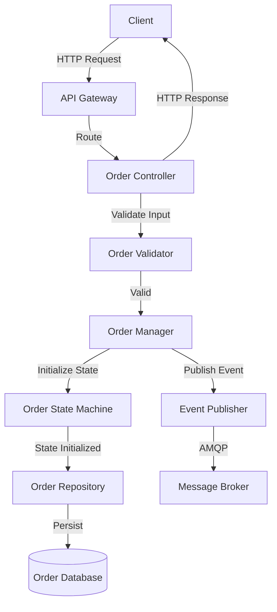
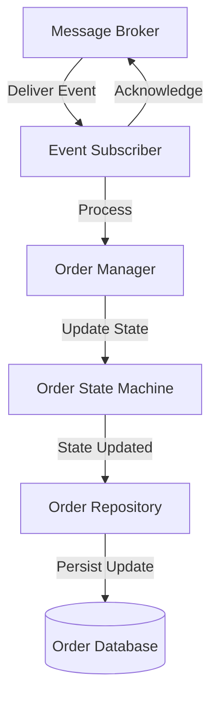

# Order Service Component View

**Level:** C4 Model - Level 3 (Component Decomposition)
**Source:** [Structurizr DSL](./structurizr-dsl/order-service-component.dsl)

## Overview

The **Order Service Component View** is the third level of the C4 model that zooms into the Order Service microservice to reveal its internal components and their interactions. The Order Service is responsible for managing the complete order lifecycle, from creation through delivery and cancellation.

## Architecture Diagram

This diagram illustrates the internal component architecture, showing:
- **API & Request Handling** layer for HTTP endpoints
- **Business Logic** layer for order processing
- **Data Access** layer for persistence
- **Event-Driven Communication** for asynchronous messaging
- **Supporting Components** for configuration and logging

---

## Service Purpose 🎯

The **Order Service** is a critical microservice in the e-commerce platform that:
- Creates and manages customer orders
- Handles order state transitions (pending, confirmed, shipped, delivered, cancelled)
- Validates orders against business rules
- Communicates with other services asynchronously via events
- Tracks order history and status
- Integrates with Payment Service, Product Service, and Customer Service

## Core Components

### 1️⃣ API & Request Handling

**Order Controller** 🌐
- **Technology:** Express.js (REST API)
- **Responsibility:** Entry point for all order-related HTTP requests
- **Key Responsibilities:**
  - Accepts incoming REST API requests (create order, get order, list orders, cancel order)
  - Validates request format and structure
  - Routes valid requests to the Order Manager
  - Returns HTTP responses to clients
  - Logs all API calls for audit trails
  - Reads service configuration

**Error Handler** ⚠️
- **Technology:** Node.js Module
- **Responsibility:** Centralized error handling and recovery
- **Key Responsibilities:**
  - Handles validation errors from Order Validator
  - Implements retry logic for transient failures
  - Converts exceptions into appropriate HTTP error responses
  - Logs errors for debugging and monitoring

---

### 2️⃣ Business Logic

**Order Manager** 📋
- **Technology:** Node.js Service
- **Responsibility:** Orchestrates the order processing workflow
- **Key Responsibilities:**
  - Receives order creation requests from Order Controller
  - Invokes Order Validator for business rule validation
  - Manages order state transitions via Order State Machine
  - Persists orders using Order Repository
  - Publishes order events to Message Broker
  - Handles cross-service calls to Customer Service and Product Service
  - Subscribes to external events (PaymentProcessed, InventoryReserved)
  - Logs all operations for auditing

**Order Validator** ✓
- **Technology:** Node.js Module
- **Responsibility:** Validates order data and enforces business rules
- **Key Responsibilities:**
  - Validates order structure and required fields
  - Checks order item quantities and availability
  - Verifies pricing calculations
  - Enforces business rules (minimum order value, allowed item quantities, etc.)
  - Reports validation errors to Error Handler

**Order State Machine** ⚙️
- **Technology:** Finite State Machine Pattern
- **Responsibility:** Manages order lifecycle state transitions
- **Key Responsibilities:**
  - Maintains order state (pending, confirmed, shipped, delivered, cancelled)
  - Validates state transitions according to business rules
  - Prevents invalid state transitions
  - Triggers events on state changes
  - Ensures orders follow proper workflow

---

### 3️⃣ Data Access

**Order Repository** 🗄️
- **Technology:** Node.js ORM (TypeORM/Sequelize)
- **Responsibility:** Abstracts database access for order persistence
- **Key Responsibilities:**
  - Implements Create, Read, Update, Delete operations for orders
  - Handles SQL queries and transaction management
  - Maps order entities to database records
  - Logs database operations for auditing

---

### 4️⃣ Event-Driven Communication

**Event Publisher** 📤
- **Technology:** Node.js AMQP Client
- **Responsibility:** Publishes order events to the Message Broker
- **Key Responsibilities:**
  - Publishes `OrderCreated` events when orders are created
  - Publishes `OrderConfirmed` events when orders are confirmed
  - Publishes `OrderCancelled` events when orders are cancelled
  - Ensures reliable message delivery
  - Reads broker configuration

**Event Subscriber** 📥
- **Technology:** Node.js AMQP Client
- **Responsibility:** Subscribes to external events from the Message Broker
- **Key Responsibilities:**
  - Listens for `PaymentProcessed` events from Payment Service
  - Listens for `InventoryReserved` events from Product Service
  - Invokes Order Manager to handle these events
  - Updates order state based on external events
  - Implements error handling for failed event processing

---

### 5️⃣ Supporting Components

**Logger** 📝
- **Technology:** Winston/Pino
- **Responsibility:** Centralized logging for debugging and monitoring
- **Key Responsibilities:**
  - Logs API requests and responses
  - Logs business logic operations
  - Logs database operations
  - Logs errors and exceptions
  - Provides structured logging for analysis

**Configuration** ⚙️
- **Technology:** Node.js Config
- **Responsibility:** Manages environment variables and service configuration
- **Key Responsibilities:**
  - Centralized configuration management
  - Environment-specific settings (dev, test, production)
  - Database connection parameters
  - Message broker settings
  - API endpoints for dependent services
  - Service-specific business rules and constants

---## Component Interactions

### Request Processing Flow 🔄

1. **Order Controller** receives HTTP request from client
2. **Order Controller** calls **Order Validator** to check input
3. **Order Validator** reports errors to **Error Handler** if validation fails
4. **Order Controller** calls **Order Manager** for valid requests
5. **Order Manager** calls **Order State Machine** to initialize order state
6. **Order Manager** calls **Order Validator** again for business rules
7. **Order Manager** calls **Order Repository** to persist the order
8. **Order Repository** writes to database via SQL queries
9. **Order Manager** publishes `OrderCreated` event via **Event Publisher**
10. **Event Publisher** sends event to **Message Broker**
11. **Order Controller** returns HTTP response with order details

### Cross-Service Collaboration 🔗

- **Order Manager** → **Customer Service**: Validates customer exists and is active
- **Order Manager** → **Product Service**: Checks product availability and inventory
- **Order Service** ← **Message Broker**: Receives `PaymentProcessed` and `InventoryReserved` events
- **Event Subscriber** processes external events and updates order state via **Order Manager**

### Logging & Monitoring 📊

All components report to **Logger** for comprehensive audit trails:
- **Order Controller** logs all API requests and responses
- **Order Manager** logs business operations and state changes
- **Order Repository** logs database activity and transactions
- **Error Handler** logs all exceptions and retries
- **Event Publisher/Subscriber** log message broker interactions

---
## Technology Stack

| Component | Technology |
|-----------|-----------|
| **API** | Express.js |
| **Business Logic** | Node.js |
| **State Management** | Finite State Machine Pattern |
| **Data Access** | TypeORM/Sequelize ORM |
| **Database** | PostgreSQL |
| **Event Messaging** | RabbitMQ (AMQP) |
| **Logging** | Winston/Pino |
| **Configuration** | Node.js Config |

## Key Design Patterns

| Pattern | Description |
|---------|-------------|
| **MVC Pattern** | Separation of concerns with Controller, Manager, and Data Access layers |
| **Repository Pattern** | Abstraction of database access logic |
| **State Machine Pattern** | Manages complex order state transitions |
| **Event-Driven Architecture** | Loose coupling via asynchronous events |
| **Error Handler Pattern** | Centralized error handling and retry logic |
| **Configuration Pattern** | External configuration management |

## Data Flow

### Create Order Sequence

### Handle External Event Sequence

## Related Documentation

- **[Container View](./container.md)** — Order Service within container architecture
- **[System Context](./system-context.md)** — High-level system context
- **[Payment Service Component](./payment-service-component.md)** — Related Payment Service architecture
- **[Architecture Decision Records](../adr/README.md)** — Key architectural decisions
- **[Order Domain Model](../models/domain/order.md)** — Order entity definition
- **[Create Order Flow](../models/flows/create-order.md)** — Business process workflow
