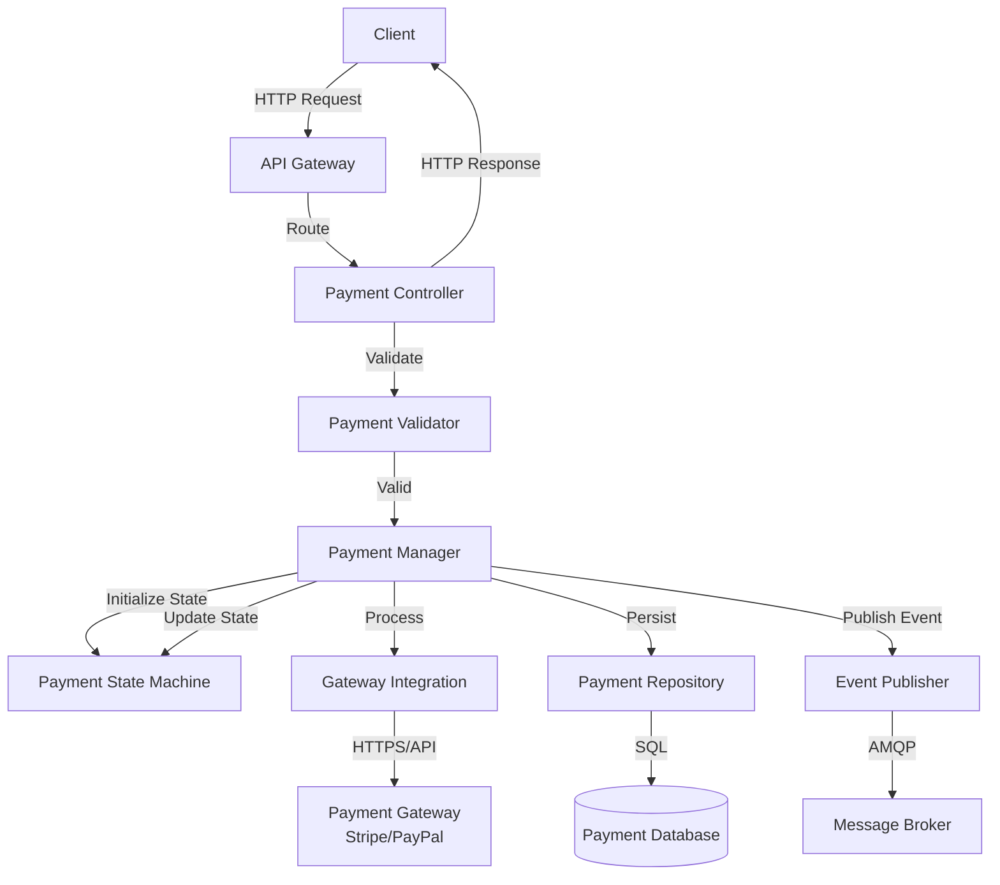
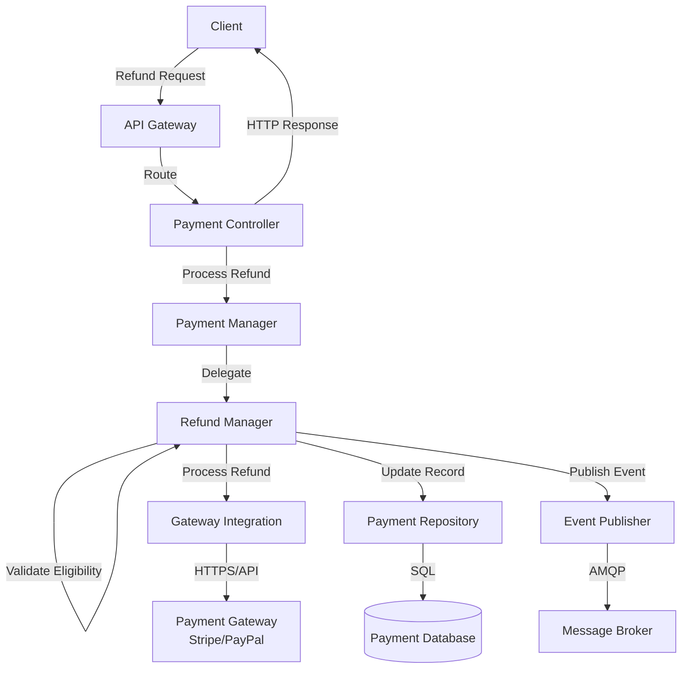

# Payment Service Component View

**Level:** C4 Model - Level 3 (Component Decomposition)
**Source:** [Structurizr DSL](./structurizr-dsl/payment-service-component.dsl)

## Overview

The **Payment Service Component View** is the third level of the C4 model that zooms into the Payment Service microservice to reveal its internal components and their interactions. The Payment Service is responsible for securely processing customer payments, managing payment state, and handling refunds.

## Architecture Diagram

This diagram illustrates the internal component architecture, showing:
- **API & Request Handling** layer for HTTP endpoints
- **Business Logic** layer for payment processing
- **External Integration** with Payment Gateways
- **Data Access** layer for persistence
- **Event-Driven Communication** for asynchronous messaging
- **Supporting Components** for configuration and logging

---

## Service Purpose 🎯

The **Payment Service** is a critical microservice in the e-commerce platform that:
- Processes customer payments securely
- Manages payment state transitions (pending, processing, authorized, captured, failed, refunded)
- Integrates with external payment gateways (Stripe, PayPal)
- Handles refund requests and processing
- Validates payment data and business rules
- Communicates with Order Service and publishes payment events
- Maintains complete payment transaction history

## Core Components

### 1️⃣ API & Request Handling

**Payment Controller** 🌐
- **Technology:** Express.js (REST API)
- **Responsibility:** Entry point for all payment-related HTTP requests
- **Key Responsibilities:**
  - Accepts incoming REST API requests (process payment, get payment, refund, etc.)
  - Validates request format and structure
  - Routes valid requests to the Payment Manager
  - Returns HTTP responses to clients
  - Logs all API calls for audit trails
  - Reads service configuration

**Error Handler** ⚠️
- **Technology:** Node.js Module
- **Responsibility:** Centralized error handling and recovery
- **Key Responsibilities:**
  - Handles validation errors from Payment Validator
  - Implements retry logic for transient failures (network issues, timeouts)
  - Converts exceptions into appropriate HTTP error responses
  - Logs errors for debugging and monitoring
  - Prevents duplicate payment processing

---

### 2️⃣ Business Logic

**Payment Manager** 💼
- **Technology:** Node.js Service
- **Responsibility:** Orchestrates the payment processing workflow
- **Key Responsibilities:**
  - Receives payment requests from Payment Controller
  - Invokes Payment Validator for business rule validation
  - Manages payment state transitions via Payment State Machine
  - Coordinates with Gateway Integration for external processing
  - Persists payment records using Payment Repository
  - Publishes payment events (PaymentAuthorized, PaymentCaptured, etc.)
  - Handles refund requests by delegating to Refund Manager
  - Logs all operations

**Payment Validator** ✓
- **Technology:** Node.js Module
- **Responsibility:** Validates payment data and business rules
- **Key Responsibilities:**
  - Validates payment structure and required fields
  - Checks payment amount (minimum, maximum, precision)
  - Verifies payment method is valid
  - Enforces business rules (fraud checks, payment limits, etc.)
  - Validates currency and amount calculations
  - Reports validation errors to Error Handler

**Payment State Machine** ⚙️
- **Technology:** Finite State Machine
- **Responsibility:** Manages payment lifecycle state transitions
- **Key Responsibilities:**
  - Maintains payment state (pending, processing, authorized, captured, failed, refunded)
  - Validates state transitions according to business rules
  - Prevents invalid state transitions
  - Triggers events on state changes
  - Ensures payments follow proper workflow
  - Tracks payment history and state changes

---

### 3️⃣ External Integration

**Gateway Integration** 🔗
- **Technology:** Payment Gateway SDK (Stripe/PayPal/etc.)
- **Responsibility:** Integrates with external payment providers
- **Key Responsibilities:**
  - Initiates payment processing with external payment gateway
  - Handles API authentication and security
  - Sends payment request to Payment Gateway
  - Processes payment responses (authorization codes, transaction IDs)
  - Handles payment failures and error codes
  - Logs all gateway interactions
  - Reads gateway configuration (API keys, endpoints)
  - Implements retry logic for network failures

---

### 4️⃣ Data Access

**Payment Repository** 🗄️
- **Technology:** Node.js ORM (TypeORM/Sequelize)
- **Responsibility:** Abstracts database access for payment persistence
- **Key Responsibilities:**
  - Implements Create, Read, Update, Delete operations for payments
  - Handles SQL queries and transaction management
  - Maps payment entities to database records
  - Persists payment state changes
  - Maintains transaction history and audit trail
  - Logs database operations
  - Reads database configuration

---

### 5️⃣ Event-Driven Communication

**Event Publisher** 📤
- **Technology:** Node.js AMQP Client
- **Responsibility:** Publishes payment events to the Message Broker
- **Key Responsibilities:**
  - Publishes `PaymentAuthorized` events when payments are authorized
  - Publishes `PaymentCaptured` events when payments are captured
  - Publishes `PaymentFailed` events when payments fail
  - Publishes `PaymentRefunded` events when refunds are processed
  - Ensures reliable message delivery
  - Reads broker configuration

**Event Subscriber** 📥
- **Technology:** Node.js AMQP Client
- **Responsibility:** Subscribes to external events from the Message Broker
- **Key Responsibilities:**
  - Listens for `OrderCreated` events from Order Service
  - Invokes Payment Manager to initiate payment for new orders
  - Handles event processing errors gracefully
  - Implements message acknowledgment for reliability
  - Reads broker configuration

---

### 6️⃣ Refund Processing

**Refund Manager** 🔄
- **Technology:** Node.js Service
- **Responsibility:** Handles refund requests and processing
- **Key Responsibilities:**
  - Receives refund requests from Payment Manager
  - Validates refund eligibility (within refund window, valid order status)
  - Calls Gateway Integration to process refund with payment provider
  - Updates payment state to `refunded`
  - Publishes `PaymentRefunded` event via Event Publisher
  - Updates payment record in database via Payment Repository
  - Logs refund operations

---

### 7️⃣ Supporting Components

**Logger** 📝
- **Technology:** Winston/Pino
- **Responsibility:** Centralized logging for debugging and monitoring
- **Key Responsibilities:**
  - Logs API requests and responses
  - Logs payment processing operations
  - Logs gateway integration calls and responses
  - Logs database operations
  - Logs errors and exceptions
  - Provides structured logging for security audit trails

**Configuration** ⚙️
- **Technology:** Node.js Config
- **Responsibility:** Manages environment variables and service configuration
- **Key Responsibilities:**
  - Centralized configuration management
  - Environment-specific settings (dev, test, production)
  - Payment gateway credentials and API keys
  - Database connection parameters
  - Message broker settings
  - Payment processing business rules and limits
  - Logging and monitoring configuration

---

## Component Interactions

### Payment Processing Flow 🔄

1. **Payment Controller** receives HTTP request
2. **Payment Controller** calls **Payment Validator** to check input
3. **Payment Validator** reports errors to **Error Handler** if validation fails
4. **Payment Controller** calls **Payment Manager** for valid requests
5. **Payment Manager** calls **Payment State Machine** to initialize payment state
6. **Payment Manager** calls **Gateway Integration** to process payment
7. **Gateway Integration** calls **Payment Gateway** (external)
8. **Payment Manager** calls **Payment State Machine** to update state based on result
9. **Payment Manager** calls **Payment Repository** to persist the payment
10. **Payment Repository** writes to database via SQL queries
11. **Payment Manager** publishes payment event via **Event Publisher**
12. **Event Publisher** sends event to **Message Broker**

---

### Refund Processing Flow 🔄

1. **Payment Controller** receives refund request
2. **Payment Controller** calls **Payment Manager**
3. **Payment Manager** calls **Refund Manager**
4. **Refund Manager** validates refund eligibility
5. **Refund Manager** calls **Gateway Integration** to process refund
6. **Gateway Integration** calls **Payment Gateway** (external)
7. **Refund Manager** calls **Payment Repository** to update payment record
8. **Refund Manager** publishes `PaymentRefunded` event via **Event Publisher**

---

### Event Subscription Flow 📨

1. **Message Broker** delivers `OrderCreated` event
2. **Event Subscriber** receives event
3. **Event Subscriber** calls **Payment Manager** to process order payment
4. **Payment Manager** initiates payment processing workflow

---

### Cross-Service Communication 🔗

- **Payment Service** → **Order Service**: Updates order status when payment is captured
- **Payment Service** ← **Message Broker**: Receives `OrderCreated` events
- **Payment Service** ↔ **Payment Gateway**: Synchronous payment processing via HTTPS/API

---

## Technology Stack

| Component | Technology |
|-----------|-----------|
| **API** | Express.js |
| **Business Logic** | Node.js |
| **State Management** | Finite State Machine Pattern |
| **Data Access** | TypeORM/Sequelize ORM |
| **Database** | PostgreSQL |
| **Payment Gateway Integration** | Stripe/PayPal SDK |
| **Event Messaging** | RabbitMQ (AMQP) |
| **Logging** | Winston/Pino |
| **Configuration** | Node.js Config |

## Key Design Patterns

| Pattern | Description |
|---------|-------------|
| **MVC Pattern** | Separation of concerns with Controller, Manager, and Data Access layers |
| **Repository Pattern** | Abstraction of database access logic |
| **State Machine Pattern** | Manages complex payment state transitions |
| **Event-Driven Architecture** | Loose coupling via asynchronous events |
| **Error Handler Pattern** | Centralized error handling and retry logic |
| **Adapter Pattern** | Gateway Integration adapts different payment providers |
| **Configuration Pattern** | External configuration management for security |

## Security Considerations 🔐

- **PCI Compliance** — Follows PCI-DSS standards for payment processing
- **Data Protection** — Sensitive payment data is not logged directly
- **API Key Management** — Payment gateway credentials stored in configuration
- **Encryption** — All external communication uses HTTPS/TLS
- **Error Handling** — Generic error messages to prevent information leakage
- **Audit Trail** — Complete logging of all payment transactions for compliance

## Data Flow

### Payment Processing Sequence

### Refund Processing Sequence

## Related Documentation

- **[Container View](./container.md)** — Payment Service within container architecture
- **[System Context](./system-context.md)** — High-level system context
- **[Order Service Component](./order-service-component.md)** — Related Order Service architecture
- **[Architecture Decision Records](../adr/README.md)** — Key architectural decisions
- **[Payment Domain Model](../models/domain/payment.md)** — Payment entity definition
- **[Payment Processing Flow](../models/flows/payment-processing.md)** — Business process workflow
