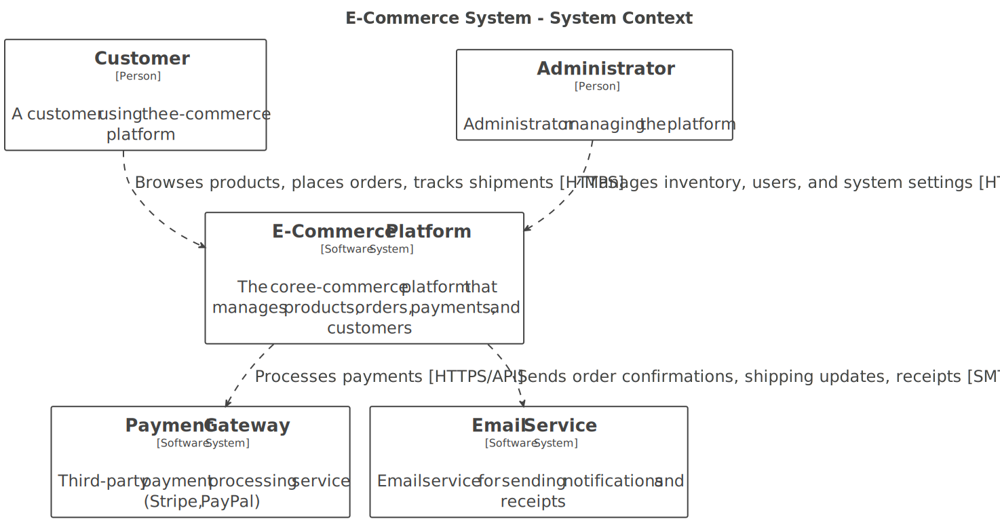

# System Context

**Level:** C4 Model - Level 1 (System Context)
**Source:** [Structurizr DSL](./structurizr-dsl/system-context.dsl)

## Overview

The **E-Commerce System Context** diagram illustrates the high-level architecture of the e-commerce platform and its interactions with external systems and users. This C4 model level provides a bird's-eye view of the entire system boundary and the external dependencies that the platform relies on.

## Architecture Diagram

This diagram shows the E-Commerce Platform at the center with:
- **External Actors** (Customers, Administrators) using the system
- **External Systems** (Payment Gateway, Email Service) that the platform depends on
- **Communication Protocols** used for each interaction

---

## System Scope

The **E-Commerce Platform** 🛒 is the central software system that serves as the core hub for all e-commerce operations. It manages:

| Capability | Description |
|-----------|-------------|
| **Product Catalog** 🏷️ | Browse and search products with detailed information |
| **Order Management** 📦 | Create, track, and manage customer orders |
| **Payment Processing** 💳 | Securely handle payment transactions and refunds |
| **Customer Accounts** 👥 | Manage customer profiles and order history |
| **Inventory Management** 📊 | Track stock levels and availability |
| **Notifications** 📧 | Send order confirmations, shipping updates, and receipts |

---

## Key Actors

### 1. **Customer** 🛍️

**Role:** End-user who purchases products from the platform

**Capabilities:**
- Browse and search for products
- Place and manage orders
- Track shipment status
- View order history and receipts
- Manage account profile and payment methods

**Interaction Protocol:** HTTPS (Secure Web)
- **Endpoint:** Web Application via API Gateway
- **Authentication:** User login credentials

---

### 2. **Administrator** 👨‍💼

**Role:** Internal system user with elevated privileges

**Capabilities:**
- Manage product inventory and listings
- Monitor orders and fulfillment status
- Manage customer accounts and support issues
- Monitor payment transactions and refunds
- Generate reports and analytics
- Configure system settings

**Interaction Protocol:** HTTPS (Secure Web)
- **Endpoint:** Admin Portal via API Gateway
- **Authentication:** Admin credentials with role-based access control (RBAC)

---

## External Systems

### 1. **Payment Gateway** 💳

**Type:** Third-party payment processor (e.g., Stripe, PayPal)

**Purpose:** Securely process customer payments, validate card information, and manage payment methods

**Responsibilities:**
- Process credit/debit card transactions
- Handle payment authorization and settlement
- Manage refunds and chargebacks
- Provide payment security and PCI compliance
- Handle fraud detection

**Interaction Protocol:** HTTPS/REST API
**Frequency:** Synchronous (real-time) for each payment transaction
**Data Flow:**
- Platform → Gateway: Payment request with card/wallet details
- Gateway → Platform: Authorization response with transaction ID

**Security:** API Key authentication, encrypted data transmission, PCI-DSS compliance

---

### 2. **Email Service** 📧

**Type:** External email delivery service

**Purpose:** Deliver reliable, scalable email notifications to customers and administrators

**Responsibilities:**
- Send transactional emails reliably
- Track email delivery status
- Handle bounce management
- Provide email templates and customization
- Log all email communications

**Interaction Protocol:** SMTP/REST API
**Frequency:** Asynchronous (batch or event-driven)
**Data Flow:**
- Platform → Email Service: Email with recipient, subject, body, templates
- Email Service → Recipients: Delivered email

**Notification Types:**
- Order confirmations
- Shipping updates and tracking information
- Payment receipts
- Account notifications (registration, password reset, profile updates)
- Promotional campaigns (optional)

---

## Communication Patterns

| Actor/System | Protocol | Direction | Purpose |
|-------------|----------|-----------|---------|
| **Customer** ↔ **Platform** | HTTPS | Bidirectional | User interacts with web app |
| **Administrator** ↔ **Platform** | HTTPS | Bidirectional | Admin manages system |
| **Platform** → **Payment Gateway** | HTTPS/REST API | Synchronous | Process payments |
| **Platform** → **Email Service** | SMTP/REST API | Asynchronous | Send notifications |

---

## System Boundaries

### Inside the Platform 🔒
- User interface and experience
- Order management and fulfillment
- Customer data management
- Business logic and workflows
- Internal service communication

### Outside the Platform 🌐
- Payment processing (delegated to Payment Gateway)
- Email delivery (delegated to Email Service)
- Customer devices and networks
- Third-party integrations

---

## Key Dependencies

| Dependency | Risk Level | Mitigation |
|-----------|-----------|-----------|
| **Payment Gateway availability** | High | Implement fallback payment methods, retry logic, circuit breakers |
| **Email Service uptime** | Medium | Queue notifications, implement retry mechanism, fallback provider |
| **Internet connectivity** | Medium | Handle offline gracefully, queue operations, sync when available |

---

## Next Steps in Architecture

**Ready to dive deeper?**
- **[→ Container View](./container.md)** — Explore the internal structure and microservices
- **[→ Order Service Component](./order-service-component.md)** — See how orders are processed
- **[→ Payment Service Component](./payment-service-component.md)** — Understand payment workflows

---

## Related Documentation

- **[Container Architecture](./container.md)** — Detailed view of internal system components and microservices
- **[Architecture Decision Records](../adr/README.md)** — Key architectural decisions and rationale
- **[Domain Models](../models/domain/README.md)** — Entity definitions and relationships
- **[System Flows](../models/flows/README.md)** — Business process workflows
- **[Requirements](../../docs/requirements.md)** — Functional and non-functional requirements
