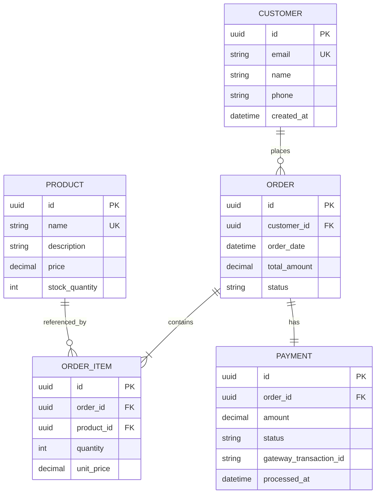

# Domain Model

This directory contains the core domain entities that represent the business logic of the system. Each entity is documented with its business rules, database schema, relationships, and API contract.

## Entity Relationship Diagram

## Entity Index

### [Customer](customer.md)
The Customer entity represents a user who can place orders in the system.

**Key Attributes:**
- Unique identity (UUID)
- Email address (unique)
- Name and contact information
- Creation timestamp for auditing

**Key Relationships:**
- Places multiple orders
- Has payment methods

---

### [Order](order.md)
The Order entity represents a customer's purchase request.

**Key Attributes:**
- Unique identity (UUID)
- Customer reference
- Order date and total amount
- Status tracking (pending, confirmed, shipped, delivered, cancelled)

**Key Relationships:**
- Belongs to one customer
- Contains multiple order items
- Associated with one payment

---

### [OrderItem](order-item.md)
The OrderItem entity represents an individual product within an order.

**Key Attributes:**
- Unique identity (UUID)
- Order and product references
- Quantity ordered
- Unit price captured at order time (immutable)

**Key Relationships:**
- Belongs to one order
- References one product

---

### [Payment](payment.md)
The Payment entity represents a payment transaction for an order.

**Key Attributes:**
- Unique identity (UUID)
- Order reference (1:1 relationship)
- Payment amount
- Status tracking (pending, processing, successful, failed, refunded)
- Gateway transaction ID for external integrations

**Key Relationships:**
- Belongs to one order

---

### [Product](product.md)
The Product entity represents an item available for purchase in the catalog.

**Key Attributes:**
- Unique identity (UUID)
- Name (unique)
- Description and pricing
- Stock quantity tracking
- Creation and update timestamps

**Key Relationships:**
- Referenced by multiple order items

---

## Business Flows

The domain entities work together to support the following key business flows:

- **[Create Order Flow](../flows/create-order.md)** — Complete order creation process involving Customer, Order, OrderItem, Product, and Payment
- **[Payment Processing Flow](../flows/payment-processing.md)** — Payment validation and gateway integration
- **[Inventory Management Flow](../flows/inventory-management.md)** — Stock tracking and concurrent update handling

## Key Design Decisions

### UUID Primary Keys
All entities use UUID primary keys for distributed system compatibility. See [ADR-0001: Use UUID Primary Keys](../../adr/0001-use-uuid-primary-keys.md).

### Price Immutability
Order items capture the unit price at order creation time. This price is immutable, even if the product price changes later. This preserves historical pricing for accounting and customer trust.

### One Payment Per Order
Each order has exactly one payment record. Failed payments create new payment records rather than updating existing ones, supporting idempotent retry logic.

### Stock Locking
Product stock updates use database-level locking to prevent race conditions and overselling in concurrent order scenarios.

## Documentation Standards

Each entity document includes:
- **Business Logic** — What the entity represents and what it does
- **Class Diagram** — Object-oriented view using Mermaid syntax
- **Database Schema** — Relational view with constraints
- **Fields** — Detailed field descriptions, types, and constraints
- **Relationships** — How entities relate to each other
- **Business Rules** — Rules governing entity behavior
- **Methods** — Key operations and their contracts
- **API Endpoints** — REST endpoints for the entity
- **Related Flows** — Links to business processes
- **Related Requirements** — Links to functional and non-functional requirements
- **Related User Stories** — Links to user stories

---

**Navigation:**
- [Architecture Overview](../../README.md)
- [Models Directory](../README.md)
- [Business Flows](../flows/README.md)
- [Architecture Decision Records](../../adr/README.md)

