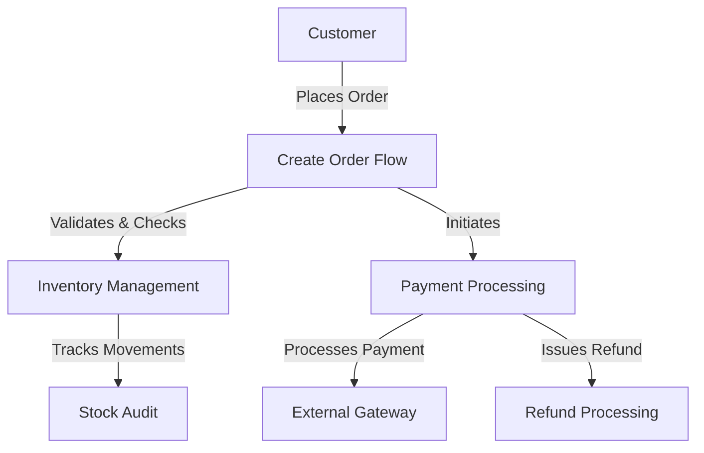

# Business Process Flows

This directory contains detailed documentation of key business processes and workflows in the system. Each flow includes sequence diagrams, step-by-step descriptions, error handling strategies, and related entities.

## Overview

The system implements three core business flows that handle order processing, inventory management, and payment processing. These flows are designed with ACID transactions, concurrency control, and error handling to ensure data consistency and reliability.

## Flows Index

### 1. [Create Order Flow](create-order.md)

**Purpose:** Describes how customers create orders and how the system manages order creation with inventory allocation and payment.

**Key Aspects:**
- Customer order validation
- Stock availability checking
- Atomic transaction management
- Inventory reduction
- Payment initiation and confirmation

**Sequence Diagram:**
```
Client → OrderService → ProductService → Database → PaymentService
```

**Main Steps:**
1. Validate request (customer ID, items)
2. Check stock availability
3. Begin database transaction
4. Create order record
5. Create order items
6. Reduce product stock (atomically)
7. Process payment
8. Finalize order or rollback on failure

**Key Features:**
- ACID transactions prevent overselling
- Atomic stock updates with WHERE clause validation
- Race condition handling for concurrent orders
- Rollback on payment failure restores inventory
- Error responses for stock depletion and payment failures

**Related Entities:** [Customer](../domain/customer.md), [Order](../domain/order.md), [OrderItem](../domain/order-item.md), [Product](../domain/product.md), [Payment](../domain/payment.md)

**Related Requirements:** FR-004, FR-011, FR-012, NFR-001, NFR-006

---

### 2. [Inventory Management Flow](inventory-management.md)

**Purpose:** Describes how product inventory is tracked, updated, and maintained across the system, including stock movements, replenishment, and auditing.

**Key Aspects:**
- Real-time stock tracking
- Atomic stock reduction during orders
- Stock replenishment workflows
- Physical inventory audits
- Low stock alerts and thresholds

**Sub-flows:**
- **Stock Update Flow:** Reduces stock when orders are placed with pessimistic locking
- **Stock Replenishment Flow:** Adds inventory during restocking events
- **Inventory Audit Flow:** Adjusts stock based on physical counts

**Sequence Diagram (Stock Update):**
```
OrderService → ProductService → Database (with FOR UPDATE locking)
```

**Stock Movement Tracking:**
All stock changes are logged in a `stock_movements` table with audit trail:
- `order_placed` (negative delta)
- `order_cancelled` (positive delta)
- `restock` (positive delta)
- `adjustment` (any delta)
- `damage` (negative delta)
- `return` (positive delta)

**Concurrency Control:**
- Pessimistic locking with `SELECT ... FOR UPDATE`
- Row-level database locks prevent race conditions
- Atomic check-and-update operations

**Low Stock Alerts:**
- Low stock threshold: ≤ 10 units → Email admin
- Out of stock: 0 units → Urgent notification
- Stock restoration triggers confirmation

**Key Metrics:**
- Prevents overselling with atomic operations
- Maintains audit trail of all stock movements
- Supports physical count reconciliation
- Optional stock reservations for high-demand products

**Related Entities:** [Product](../domain/product.md), [Order](../domain/order.md), [OrderItem](../domain/order-item.md)

**Related Requirements:** FR-010, FR-011, FR-012

---

### 3. [Payment Processing Flow](payment-processing.md)

**Purpose:** Describes how payments are processed securely through external payment gateways (Stripe), with comprehensive error handling and compliance.

**Key Aspects:**
- Payment gateway integration (Stripe)
- PCI-DSS compliance
- Idempotent payment operations
- Comprehensive error handling
- Refund processing
- Fraud prevention

**Sequence Diagram:**
```
OrderService → PaymentService → StripeGateway → Database & NotificationService
```

**Payment States:**
- `pending` → `processing` → `successful` / `failed` / `requires_reconciliation`
- `successful` → `refunded` (optional)

**Failure Scenarios:**
| Reason | Description | Action |
|--------|-------------|--------|
| `insufficient_funds` | Not enough balance | Suggest different payment method |
| `card_declined` | Card rejected | Contact bank or use different card |
| `expired_card` | Card past expiration | Update payment method |
| `processing_error` | Gateway internal error | Auto-retry (max 3 times) |
| `timeout` | No gateway response | Query status & reconcile |

**Idempotency:**
- Uses idempotency key (order_id + attempt_number)
- Prevents duplicate charges on retries
- Critical for network failure resilience

**Refund Processing:**
- Only "successful" payments can be refunded
- Full or partial refunds supported
- 30-day refund window
- 5-10 business days to customer account

**Security:**
- No raw credit card storage (tokenization)
- HTTPS/TLS encryption
- Address Verification System (AVS)
- CVV validation
- Velocity checks (max 3 failed attempts/hour)
- Audit trail for all attempts

**Monitoring:**
- Payment success rate: Target > 95%
- Processing time: Target < 2s (p99)
- Gateway timeout rate: Target < 0.1%

**Related Entities:** [Order](../domain/order.md), [Payment](../domain/payment.md), [Customer](../domain/customer.md)

**Related Requirements:** FR-007, FR-008, FR-009, NFR-003, NFR-011

---

## Flow Relationships



## Key Design Patterns

### 1. ACID Transactions
All flows use database transactions to ensure atomicity, consistency, isolation, and durability.

### 2. Idempotency
- Order creation uses order_id as idempotency key
- Payment processing uses order_id + attempt_number
- Safe to retry operations without side effects

### 3. Pessimistic Locking
- Stock updates use `SELECT ... FOR UPDATE` row locks
- Prevents concurrent overselling
- Trade-off: Reduced concurrency for consistency guarantee

### 4. Asynchronous Notifications
- Email receipts and notifications are queued asynchronously
- Non-blocking operations improve response times
- Reliable delivery with retry logic

### 5. Comprehensive Error Handling
- Graceful degradation for gateway timeouts
- Customer-actionable error messages
- Automatic recovery where possible
- Manual intervention for edge cases

## Error Handling Summary

### Order Creation Errors
- **Insufficient Stock:** Detected before transaction (fast fail)
- **Stock Depletion:** Detected during transaction (rollback)
- **Payment Failure:** Transaction rolled back, inventory restored
- **Database Timeout:** Automatic rollback, client retry

### Inventory Errors
- **Negative Stock:** Prevented by WHERE clause validation
- **Concurrent Updates:** Serializable with pessimistic locking
- **Stale Data:** Refresh on read, invalidate on update

### Payment Errors
- **Card Declined:** Notify customer, allow retry
- **Processing Error:** Auto-retry up to 3 times
- **Gateway Timeout:** Query status and reconcile
- **Insufficient Funds:** Suggest alternative payment method

## Performance Targets

| Metric | Target | Notes |
|--------|--------|-------|
| Stock check | < 100ms | Batch queries for multiple products |
| Order creation | < 500ms | Includes DB operations |
| Payment processing | < 2s | Includes external gateway call |
| Total order flow | < 3s (p99) | End-to-end including payment |

## Testing Scenarios

### Happy Paths
- ✓ Create order with valid customer and in-stock items
- ✓ Process payment successfully
- ✓ Refund payment within window

### Concurrent Operations
- ✓ Two customers order same product simultaneously
- ✓ Only sufficient stock for one order
- ✓ First succeeds, second fails gracefully

### Error Cases
- ✓ Payment failure rolls back inventory
- ✓ Stock depleted during transaction
- ✓ Gateway timeout triggers reconciliation
- ✓ Card decline allows retry with different card

### Idempotency
- ✓ Duplicate payment requests return same intent
- ✓ Network retries don't cause double charges
- ✓ Repeated order creation calls are safe

## Related Documentation

- **Architecture:** [Architecture Overview](../README.md)
- **Domain Models:** [Domain Models](../domain/README.md)
- **Decisions:** [Architecture Decision Records](../adr/README.md)
- **System Context:** [C4 Views - System Context](../c4-views/system-context.md)
- **Containers:** [C4 Views - Container](../c4-views/container.md)

---

**Last Updated:** February 6, 2026

