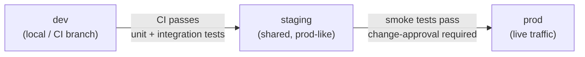

# Environments Spec

Defines the three deployment environments — **dev**, **staging**, and **prod** — their resource tiers, and the
promotion guardrails that must pass before code advances to the next stage.

---

## Promotion Pipeline

---

## Environment Comparison

| Property | dev | staging | prod |
|:--|:--|:--|:--|
| **Purpose** | Local development and CI | Pre-production validation | Live customer traffic |
| **Infrastructure size** | Minimal (single replicas) | Matches prod topology | Full HA, multi-AZ |
| **Database** | Ephemeral / in-memory or single PostgreSQL | Persistent PostgreSQL, prod schema | Persistent PostgreSQL, HA replicas |
| **RabbitMQ** | Single node, no persistence | Single node, durable queues | Clustered, durable queues |
| **Secret rotation** | Disabled (static dev secrets) | Enabled | Enabled |
| **IAM roles** | Relaxed (dev variants) | Full least-privilege | Full least-privilege |
| **Change approval** | Not required | Not required | Required (human sign-off) |
| **Data** | Seed/fixture data only | Anonymised prod-like data | Real customer data |
| **Feature flags** | All features on | Feature flags mirror prod | Feature flags controlled by ops |

---

## Promotion Gates

### dev → staging

All of the following must pass automatically in CI before a branch can be merged and deployed to staging:

- [ ] Unit tests pass
- [ ] Integration tests pass (services + DB + broker)
- [ ] IaC plan produces no unexpected resource deletions
- [ ] Security group rules validated against [networking spec](./networking.md)
- [ ] IAM policies validated against [IAM spec](./iam.md) (no wildcard grants)

### staging → prod

All of the following must pass before a production deployment is triggered:

- [ ] Smoke tests pass against staging
- [ ] No critical findings from automated security scan
- [ ] **Human change-approval** recorded (PR approval or change ticket)
- [ ] IaC plan reviewed and approved
- [ ] Rollback plan documented in the deployment PR

---

## Guardrails by Environment

| Guardrail | dev | staging | prod |
|:--|:--|:--|:--|
| Real customer data permitted | No | No | Yes |
| Wildcard IAM policies permitted | No | No | No |
| Auto-scaling enabled | No | No | Yes |
| Deletion protection on databases | No | Yes | Yes |
| Audit logging | No | Yes | Yes |
| Alerting / on-call | No | Optional | Yes |

---

## Related

- [Networking Spec](./networking.md) — topology that each environment instantiates
- [IAM Spec](./iam.md) — roles and policies applied per environment
- [ADR-0002: Microservices Architecture](../adr/0002-microservices-architecture.md)

