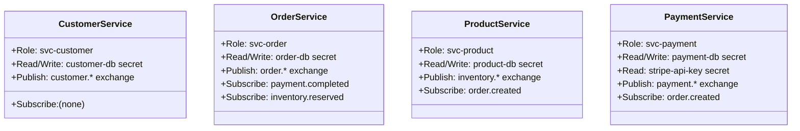

# IAM Spec

Defines per-service identities and least-privilege policies for the e-commerce platform. Each microservice gets
exactly one IAM role with only the permissions it needs — no shared credentials, no wildcard policies.

This spec is a direct consequence of [ADR-0002: Microservices Architecture](../adr/0002-microservices-architecture.md)
and [ADR-0003: Event-Driven Communication](../adr/0003-event-driven-communication.md).

---

## Identity Model

---

## Role Definitions

| Role | Assigned to | DB Secret | RabbitMQ Publish | RabbitMQ Subscribe |
|:--|:--|:--|:--|:--|
| `svc-customer` | Customer Service | `secret/customer-db` | `customer.*` | — |
| `svc-order` | Order Service | `secret/order-db` | `order.*` | `payment.completed`, `inventory.reserved` |
| `svc-product` | Product Service | `secret/product-db` | `inventory.*` | `order.created` |
| `svc-payment` | Payment Service | `secret/payment-db` | `payment.*` | `order.created` |

---

## Policy Rules

### Secrets Access

Each service may **read and rotate** only its own DB credential secret. Payment Service additionally has **read-only**
access to the external payment provider secret.

| Service | Secret | Permission |
|:--|:--|:--|
| Customer Service | `secret/customer-db` | Read, Rotate |
| Order Service | `secret/order-db` | Read, Rotate |
| Product Service | `secret/product-db` | Read, Rotate |
| Payment Service | `secret/payment-db` | Read, Rotate |
| Payment Service | `secret/stripe-api-key` | Read only |

> No service has access to another service's DB secret. Cross-service data access must go through the service's API,
> not by reading its database directly.

### RabbitMQ Permissions

Following [ADR-0003](../adr/0003-event-driven-communication.md), services own their publish exchange and subscribe to
specific queues only:

| Service | Can publish to | Can consume from |
|:--|:--|:--|
| Customer Service | `customer.*` | — |
| Order Service | `order.*` | `payment.completed`, `inventory.reserved` |
| Product Service | `inventory.*` | `order.created` |
| Payment Service | `payment.*` | `order.created` |

No service has wildcard subscribe (`#`) permissions on the broker.

---

## Guardrails

| Guardrail | Description |
|:--|:--|
| No shared credentials | Each service authenticates with its own role; no service account shared between two services |
| No wildcard secrets access | `secret/*` policies are forbidden; every grant must name a specific secret path |
| No cross-service DB access | A service may not be granted access to another service's DB secret |
| Rotation enforced | DB secrets must have automatic rotation enabled in all environments |
| Least-privilege broker | RabbitMQ policies deny publish to exchanges not owned by the service's role |

---

## Related

- [Networking Spec](./networking.md) — network-layer enforcement of these boundaries
- [Environments Spec](./environments.md) — how these roles differ per environment
- [ADR-0002: Microservices Architecture](../adr/0002-microservices-architecture.md)
- [ADR-0003: Event-Driven Communication](../adr/0003-event-driven-communication.md)

