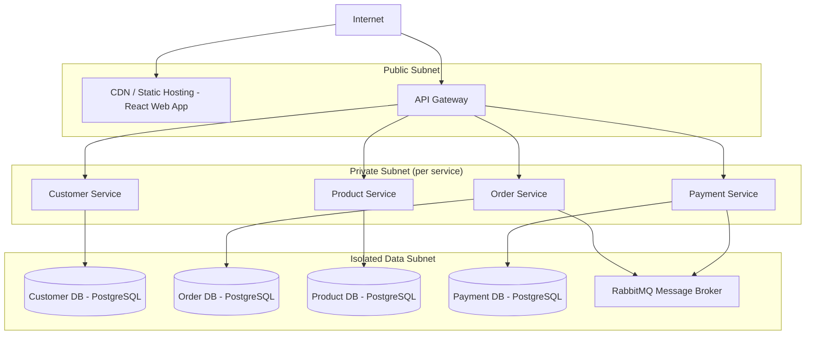

# Networking Spec

Defines the network topology for the e-commerce platform. Each microservice runs in its own isolated subnet with
tightly scoped security-group rules — a direct consequence of [ADR-0002: Microservices Architecture](../adr/0002-microservices-architecture.md).

---

## Topology Overview

---

## Subnet Definitions

| Subnet | CIDR (example) | Contents | Internet-facing |
|:--|:--|:--|:--|
| `public` | `10.0.0.0/24` | API Gateway, CDN / static hosting | Yes |
| `private-app` | `10.0.1.0/24` | Customer, Order, Product, Payment services | No |
| `isolated-data` | `10.0.2.0/24` | PostgreSQL instances (x4), RabbitMQ broker | No |

---

## Security Group Rules

### API Gateway

| Direction | Protocol | Port | Source / Destination | Purpose |
|:--|:--|:--|:--|:--|
| Inbound | HTTPS | 443 | `0.0.0.0/0` | Public traffic |
| Outbound | TCP | 8080 | `private-app` subnet | Forward to services |

### Microservices (Customer / Order / Product / Payment)

| Direction | Protocol | Port | Source / Destination | Purpose |
|:--|:--|:--|:--|:--|
| Inbound | TCP | 8080 | API Gateway SG | Requests from gateway |
| Inbound | TCP | 5672 | `isolated-data` SG | RabbitMQ delivery |
| Outbound | TCP | 5432 | `isolated-data` SG | PostgreSQL (own DB only) |
| Outbound | TCP | 5672 | `isolated-data` SG | RabbitMQ publish |

> Each service's outbound rule to PostgreSQL is scoped to its **own** database instance, not the entire data subnet.
> This enforces the database-per-service pattern from ADR-0002.

### Data Subnet (PostgreSQL + RabbitMQ)

| Direction | Protocol | Port | Source / Destination | Purpose |
|:--|:--|:--|:--|:--|
| Inbound | TCP | 5432 | `private-app` SG | Queries from services |
| Inbound | TCP | 5672 | `private-app` SG | AMQP from publishers |
| Inbound | TCP | 15672 | Internal ops only | RabbitMQ management UI |
| Outbound | — | — | None | No outbound connections |

---

## Design Decisions

| Decision | Rationale |
|:--|:--|
| No direct internet access to private/data subnets | Minimize attack surface; all public traffic flows through API Gateway |
| Separate data subnet | Prevents lateral movement between services if one is compromised |
| Per-service DB scoping in security groups | Enforces database-per-service from ADR-0002 at the network layer |
| RabbitMQ in data subnet | Broker is a data-plane resource; treated with the same isolation as databases |

---

## Related

- [IAM Spec](./iam.md) — network rules paired with identity constraints
- [Container View](../c4-views/container.md) — C4 view of the services this topology hosts
- [ADR-0002: Microservices Architecture](../adr/0002-microservices-architecture.md)
- [ADR-0003: Event-Driven Communication](../adr/0003-event-driven-communication.md)

